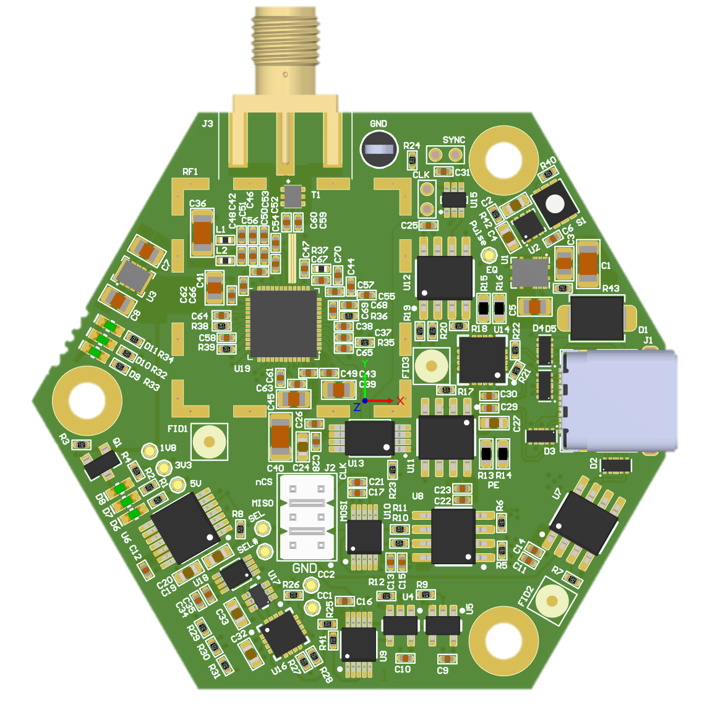

#BeeBoard 

The Beeboard is an active Ultra Wideband (UWB) antenna designed to be used with the HiveBoard. It harbors a DW1000 IC under a faraday cage
to receive the UWB signal. 

#USB-C orientation detection
The Beeboard has an automatic USB-C orentation detection system. Once the USB-C is plugged, it takes 500ms for the
board to detect and arrange the switches to correctly route the signals. 
!!! note 
    The V1.000 Beeboard was missing three pull-up resistors rendering the USB-C orientation detection unusable.
    Even if you are unsuccessful on the repair, the Beeboard is still functionnal but the user will have to find the correct orientation

#Connection with the HiveBoard V1.000
The designers made some mistakes in the routing of the signals between the HiveBoard V1.000 and the BeeBoard V1.000 and did not account
the signal switching in the USB-C cable. A small board was designed to fix these issues called the Wings. It is available at the [GitHub repo](https://www.github.com/swarmus/electrical)

!!! important
    If using the HiveBoard V1.000 and BeeBoard V1.000, do not forget to have a Wings board for each BeeBoard for correct functionning.

# BeeBoard UI

The BeeBoard has multiple user interface element useful for the user and debugging purpose.
In purple are the single-ended test point, in red the 100 mils pins for SPI and the button and in orange triangles, the LEDs.

In purple : 

1. 1.8V test point
2. 3.3V test point
3. 5V test point
4. SEL, indicates the voltage of the selection. 3.3V logic.
5. SEL#, always the inverse of SEL test point.
6. CC2, indicates the voltage on the CC2 pin at the connector
7. CC1, indicates the voltage on the CC1 pin at the connector. CC1 and CC2 voltage are used to decide the USB-C orientation
8. Pulse, the pulse test point should have a pulse 500ms after the Beeboard is powered. The pulse is used to set the gates and switches selection.
9. Ground hook. Reference all above test points with this one.
A. CLK, the clock test point has a ground pad right beside it to reduce the current return path.
B. Sync, the sync signal to synchronise the BeeBoards connected to one HiveBoard synchronised.

In red :
SPI 100 mils
1. nCS
2. SPI CLK
3. MISO
4. MOSI
5. GND
6. GND
The button on the top right of the BeeBoard has the purpose of sending a pulse to reset the gates and the USB-C orientation detection flags.

The oranges triangles represent the LEDs present on the BeeBoard, D10 and D9 are user LED connected to the DW1000 and can be used for debugging purposes.
D11 is connected to the EXTON output of the DW1000. The EXTON output is high when the DW100 is correctly powered, hence the LED should be always on.
The LEDs D8 to D6 indicates the presence of the voltage 1.8V, 3.3V and 5V and should be on at all times.

The top connector is a female SMA connector. It can be connected to any UWB antenna. The antennas used in the project are the [Ciholas](https://www.ciholas.com/) antennas.

# V2.000
The BeeBoard has a 2.000 version adressing the mistakes and bugs from V1.000, but with the new DW3220 IC on the market. The entire HiveBoard-BeeBoard design should be revised.
