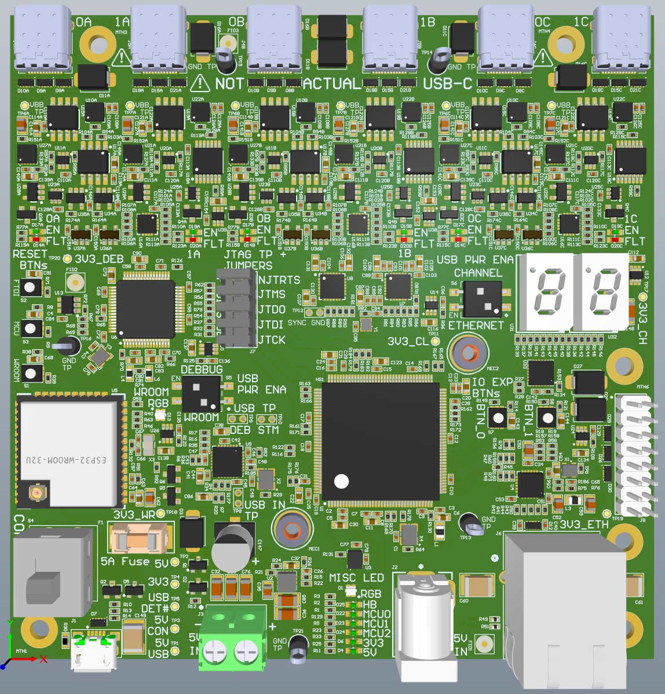

# HiveBoard V1.000
The HiveBoard is a STM32H7 based development board. It harbors 6 USB-C channels 
to which up to 6 [Beeboards]('sections\hardware\HiveBoard\hardware\BeeBoard\BeeBoard_V1.000.md' ) can be connected. 

!!! important
    The USB-C at the top end of the HiveBoard are not actual USB-C. The connector was used because it houses five differential 
    pairs which were required.

The HiveBoard is pluggable by three methods and requires X Amps of current plus X Amps per BeeBoard connected: 

1. The 5V jack 

2. The screw terminal block (+ terminal on the right side)

3. The μ-USB

The HiveBoard has the three basic protections of a complex circuit. It is protected in reverse polarity, over-voltage and overcurrent.
The absolute maximum current consumption of a HiveBoard with 6 BeeBoard attached is below 5A. 
The main switch located on the left bottom has three positions : 

Down: power is taken from the u-USB connector.

Middle: Off state

Up: power is taken from either 5V Jack or screw terminal block.

!!! important 
    If both 5V jack and screw terminal are connected, they will fight each other. Meaning that the one with lower voltage will receive 
    current from the other one. It is recommended to use only on of theses 2 methods.

!!! note
    Altough the board can be powered by μ-USB, not all the components on the board will be activated if powered by that method. 
    Refer to the [schematics](https://www.github.com/swarmus/electrical) and the [Available UI](hiveboard-ui.md) for more info
    on the switches.

## System operation

The top 6 USB-C are use to be connected to BeeBoards. The connectors are separated in pairs, (0A-1A/0B-1B/0C-1C) is supported by a single SPI channel.
In the swarmUS original code, only 3 Beeboards were connected and each of them was on a diffent SPI bus.

!!! error
    If the V1.000 version of the HiveBoard is used, reworks will be necessary for correct operation of the system.
    For more details, see the [schematics](https://www.github.com/swarmus/electrical).

The ethernet connector is used to connect the HiveBoard to the robot main computer (such as Raspberry Pi). The right side 100
mils connector is for exposing the unused I/Os of the STM32H7 to the user in the case he/she wants to supplmenet the HiveBoard
with his/her own expansion card.

The Hiveboard has an external debugger. For proper system operation and debugging via the on board debugger, the 100 mils header shall remain in place.
Otherwise, an external debugger can be plugged on the right side of the headers to access the STM32H7 directly.

