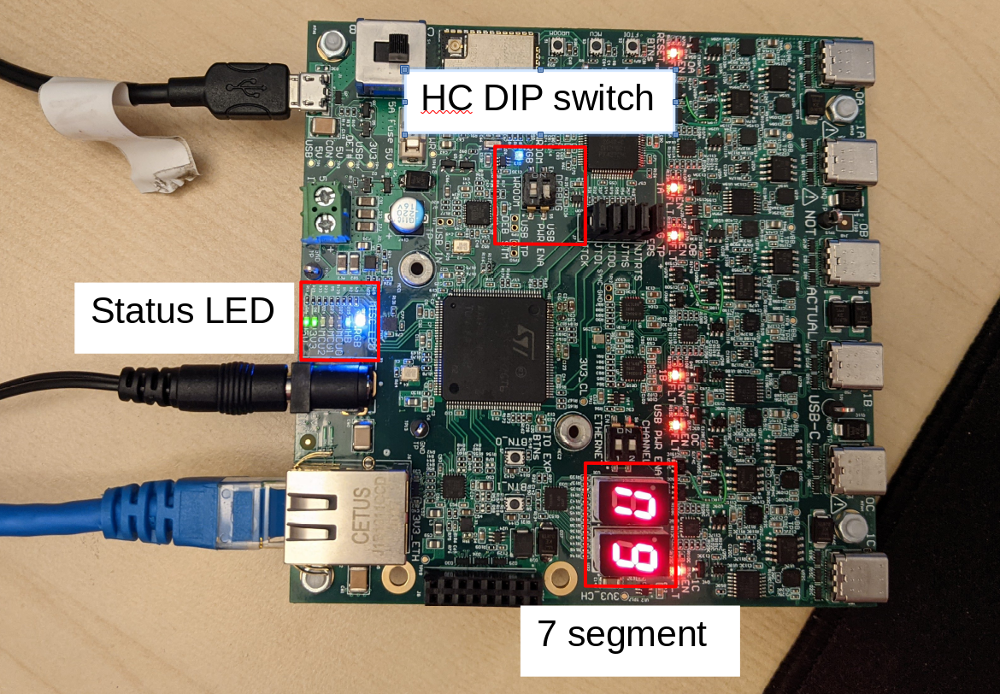

# Available UI

The HiveBoard has multiple indicators to help the user debug its configuration or its application.

## Hardware

These are the UI elements that are worth mentioning on a physical HiveBoard:

| ID on board | Description                        |
| ----------- | ---------------------------------- |
| LED RGB     | HiveMind comm interface            |
| WROOM RGB   | Networking Status LED (ESP-32)     |
| LED HB      | HiveMind heartbeat                 |
| LED MCU_0   | HiveMind and HiveConnect handshake |
| LED MCU_1   | HiveMind and Host handshake        |
| LED MCU_2   | User LED                           |
| LED 3.3v    | 3.3V is properly powered           |
| LED 5V      | 5V is properly powered             |
| 7 segment 1 | BBVM status                        |
| 7 segment 2 | User 7 segment                     |

### Power Switch

The HiveBoard can be powered either via a 5V supply plugged into the black barrel connector or via the micro-USB plug. The power switch allows you to decide from where to take the power. The _CON_ position instructs the boad to draw power from the barrel connector, while the _USB_ position has the power drawn from the USB connector.

> Even if the power switch is on _CON_, the USB port still works and can be used to communicate with the board

> When powering the board by USB, no enough power is available to power all sub-circuits. The [DIP Switches](#dip-switches) allow you to decide what to enable or disable.

### DIP Switches

Because the board can draw up to 4 A and a USB connection is limited to 500 mA, DIP switches are available to disable sub-circuits that are not needed in order to fit in the power requirements. The switches only take effect when powered by USB. If powered from CON, all circuits are always enabled.

> **Warning** The DIP switches are inverted in the first version of the HiveBoard. So when a switch is at the ON position, power is **disabled** to the given sub-circuit.

Four different circuits are controlled from the switches:

- DEBUG: Controls the chip responsible for flashing/debugging the microcontrollers as well as create serial ports needed for logging
- WROOM: Controls the ESP32 responsible for Wi-Fi communication
- CHANNEL: Controls the channel hardware (this is very power hungry and probably should never be turned on while on USB)
- ETHERNET: Controls the Ethernet port and associated hardware

In a normal usage, when plugged into a phone, all DIP switches other than WROOM should be on the ON position. This way, only the STM32 and the ESP32 are powered.

### Reset Buttons

Three reset buttons are provided on the left hand side of the board. Each one performs a hardware reset of the specified chip.

- FTDI: Chip responsible for flashing/debugging the microcontrollers as well as create serial ports needed for logging
- MCU: The main STM32 microcontroller
- WROOM: The ESP32 responsible for Wi-Fi communication

> **Note** The WROOM reset button currently only works if the ESP32 logging serial port is opened (usually ttyUSB4).

### Channel EN / FLT LEDs

Every BeeBoard channel has two LEDs associated with it. A red FLT and a green EN. Only one of the LEDs is on at any given time. A red LED means no power is currently being delivered to the channel, while the green LED means power is being delivered.

Enablement of power to a given channel is done through the code depending on which channels have BeeBoards plugged in at bootup. If multiple BeeBoards are plugged in, when powering the board up, you should see each channel that has a BeeBoard plugged in turn from red to green. If one of the channels does not change, consider testing with a different BeeBoard or USB-C cable to find the culprit.

> Before a proper HiveMind firmware is flashed to the STM32, you may notice that some channels boot up as enabled even without a BeeBoard. This is because the line controlling the enablement of the channels is floating and must therefore be pulled down by the STM32 code (HiveMind).

### LED `RGB` - HiveMind Comm Interface

Displays the status of the comm interface. Note that this means the comm interface is opened, not that the two devices communicate. They need to do a handshake after opening the interface. Thus a connection is fully established when the RGB is of color teal or blue **and** LED MCU_1 is on. If you plug the Ethernet or USB cable and the LED is not changing, make sure the TCP ports for Ethernet or the COM ports for USB match the ones that are open on the host.

The RGB LED can take the following colours:

| Colour | State                  |
| ------ | ---------------------- |
| White  | Booting                |
| Violet | Unconnected            |
| Blue   | Connected via Ethernet |
| Teal   | Connected via USB      |
| Red    | Error                  |

### LED `WROOM RGB` - Networking Status LED (ESP-32)

This RGB LED informs on the status of the Wi-Fi network. Refer to the [Wi-Fi Configuration instructions](../reference/Networking/configure-wifi.md) for the configuration procedure.

This RGB LED can take the following colours:

| Colour | State                                |
| ------ | ----------------------               |
| Green  | Connected to an existing network     |
| Yellow | Connecting                           |
| Teal   | Access point available (is router)   |
| Red    | Not Connected                        |

### LED `HB` - HiveMind Heartbeat

The heartbeat of the HiveMind indicates that the firmware runs normally. In normal operation, this LED flashes at 1 Hz. If this LED is _not_ flashing, HiveMind is probably in a hard fault state. This should not happen in theory, but things can always go wrong. Make sure everything is up to date and then you can consider raising an issue in the [HiveMind repo](https://github.com/SwarmUS/HiveMind/issues) if the issue wasn't already raised.

### LED `MCU_0` - HiveMind and HiveConnect Handshake

Shows if the HiveMind and the HiveConnect completed their handshake successfully. If the LED is not turned on after bootup, make sure everything is up to date (check versions of HiveMind and HiveConnect) and that the ESP power DIP switch is enabled.

> **Warning** The DIP switches are inverted in the first version of the HiveBoard. So ON actually disables it.

### LED `MCU_1` - HiveMind and Host Handshake

Shows if the HiveMind and the host completed their handshake successfully. If the RGB LED is on, but not `MCU_1`, make sure everything is up to date. This may be caused by an incompatible version of [Pheromones](https://github.com/SwarmUS/Pheromones) (or [Propolis](https://github.com/SwarmUS/Propolis) that used the wrong Pheromones version). These two libraries are used by various elements of the stack (HiveMind, HiveMindBridge, HiveAR), and they **must** imperatively have matching versions.

### LED `MCU_2` - User LED

LED that can be set in the Buzz script via `ui.set_led(x)`. Use this to know the state of you application for easier debugging. You can get more information in the [led blink user guide](../user-guide/basic-examples/led-flash-buzz.md). The complete API documentation can be found [here](https://swarmus.github.io/HiveMind/namespaceBittyBuzzUIFunctions.html#details).

### LED `3.3V`

Is on if the 3.3V power supply is working properly. Check the power requirements if it's not on.

### LED `5V`

Is on if the 5V power supply is working properly. Check the power requirements if it's not on.

### 7 segment 1 - BBVM status

The status of the BBVM, in which your Buzz code is run.

If it's 0, the VM, is running fine. If it's a non zero value. The value represent the error code via an enumeration.

If it's 0, the VM, is running fine. If it's a non zero value. The value represent the error code via an enumeration.

The values of the enumeration can be found [here](https://swarmus.github.io/HiveMind/SystemStates_8h.html#a0c10345a5a61ea917f59a0437ad481a0). If you want more information about the error code meaning, you can check the [BittyBuzz repo](https://github.com/buzz-lang/BittyBuzz/blob/c7b6294230819b58a2420cfd6f9847c4a927bba9/src/bittybuzz/bbzenums.h#L25).

### 7 segment 2 - User segment

A segment that can be set in the Buzz script via `ui.set_hex(x)`. Use this to have information about the state of your swarm application. You can get more information in the [led blink user guide](../user-guide/basic-examples/led-flash-buzz). The complete API documentation can be found [here](https://swarmus.github.io/HiveMind/namespaceBittyBuzzUIFunctions.html#details).

## ROS

When simulating the usage of a HiveBoard on a computer, HiveMind will simulate the lower-level hardware stack using ROS (see [HiveMind's readme](https://github.com/SwarmUS/HiveMind#readme)). This configuration replicates the interface of the HiveBoard via ROS logging system. Everytime something is written on the rosconsole, a string is prepended with the state of the HiveMind. The prepended string should be similar to:

`[HM: Id] [UI: rgb: V led: 000 hex: 01]`

- The `rgb` is expressed via the first letter of its color.

- The `led` represents the MCU 0, 1 and 2 (handshake HiveConnect, handshake Host, user LED).

- The `hex` represents the 7 segments (VM state at the left and user 7 segment at the right).
