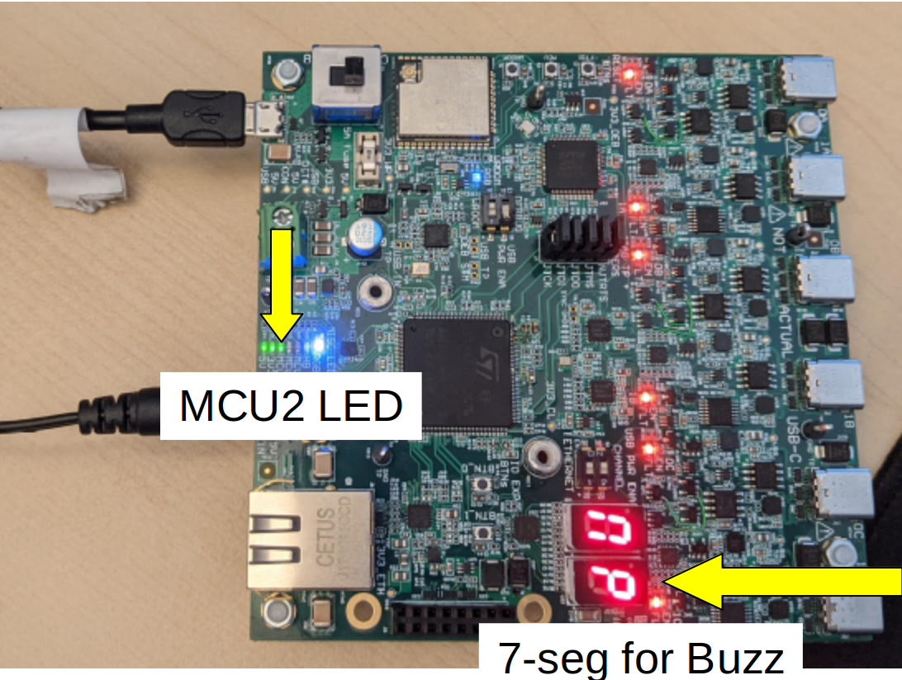

# Available APIs in Buzz Scripts

User-defined Buzz scripts can use some APIs to interact with some parts of the SwarmUS platform. This page regroups all these APIs and provides some links to their respective documentation.

## `BittyBuzzUIFunctions`: Interacting with the HiveBoard's UI

Link to the [documentation](https://swarmus.github.io/HiveMind/namespaceBittyBuzzUIFunctions.html#details).

This API provides some functions that can be used to interact with some UI elements on the HiveBoard. Users have access to one LED and one seven-segment display:

## `BittyBuzzMathFunctions`: Useful Math Tools

Link to the [documentation](https://swarmus.github.io/HiveMind/namespaceBittyBuzzMathFunctions.html)

This API provides some math functions to be used in Buzz scripts.

## `BittyBuzzUserFunctions`: Managing User Functions

Link to the [documentation](https://swarmus.github.io/HiveMind/namespaceBittyBuzzUserFunctions.html)

This API provides the necessary tools to register and call some custom functions.