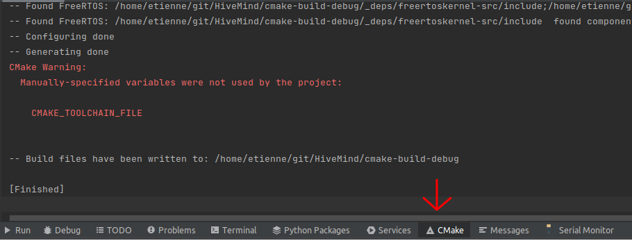
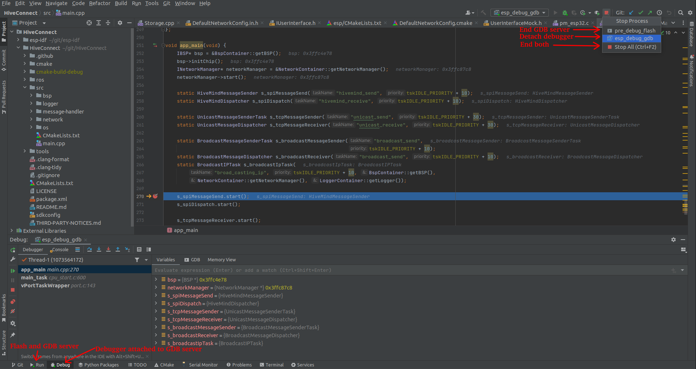

Before starting, make sure that you followed all the setup instructions of the [HiveConnect's readme](https://github.com/SwarmUS/HiveConnect). Especially take note of the path where you downloaded the `esp-idf` repository.

### Building the project

1. Open CLion
2. Open the HiveConnect folder. Go in "File->Open", found the path to the root of the HiveConnect repository and click "Open". After that step you should the project directory in the right of the screen.
3. Configure the toolchain. This step selects the build tool and compiler for the CMake profile. In the case of the HiveConnect project, it also sets important environment variables used for the building step. Go in "File->Settings". On the right menu go in "Build, Execution, Deployment->Toolchains". Create a new Toolchain, click on "Add environment -> From file" and set all the fields as follows: 
   
   For the environment file, enter`<path_to_esp-idf_directory>/esp-idf/export.sh`
4. Configure the Cmake profile. Go in "File->Settings". This step set the build type and select the toolchain file to build for the ESP32. On the right menu go in "Build, Execution, Deployment->CMake". Set all the fields as follow: 
   You can copy the "Cmake options" line: `-DCMAKE_TOOLCHAIN_FILE=cmake/esp-idf/toolchain-esp32.cmake`
5. Build the project. In the right corner, in the target drop down menu (see image below) select the target named "app". To build the project, just click on the green hammer next to the drop down menu. You can follow the building process in the "Message" tab console.
   
   This step will generate the `hive_connect.elf` and `hive_connect.bin` files that could both be used to flash the MCU.

!!! Important
    Don't start the build if the cmake has not finished its job. You can follow the progress of the cmake job in the "CMake" console tabe at the bottom of the IDE. You can also follow the progress of the building process in the "Messages" tab.

### Flashing

Now the project can be build, the compiled code in the hive_connect.elf can be flashed on the ESP32 MCU. However, compare to the HiveMind project, the same target can't be used to just build, flash and debug. You will need to switch between targets to perform those operations. However, the build action is automatically done before flashing and debugging. 

1. Go in the target drop down menu where you selected the target "hive_connect_flash".
2. Flash the board. Since the CLion is now ready and , once, the board is connected and powered, it's possible to flash the firmware.  Click on the green hammer next to the selected target. A console should be put in evidence showing the progress of the flashing process.

!!! Warning
	The "hive_connect_flash" target flashes the board with the build ("hammer") icon not the play icon like the "flash" target of the HiveMind.

### Debugging

Compare to the HiveMind firmware the HiveConnect firmware can't be debug directly by the OpenOCD target. This is mainly because the OpenOCD target flashes at the first address in memory of the flash and it would overwrite the bootloader present in the ESP32. Therefore, we need to flash the esp with OpenOCD with a new script and create a separate debug target to attach to the debug session.

1. Open the target drop down list and click on "Edit configurations".
2. Add a command to flash the board with OpenOCD. First, click on the "+" to add a new target. Add a "Shell Script" target type. Fill the fields as shown below.
   
   First you will need to select "Script text". For the script text write `~/.espressif/tools/openocd-esp32/v0.10.0-esp32-20200709/openocd-esp32/bin/openocd -s share/openocd/scripts -f <path_to_hive connect_directory>/HiveConnect/tools/openocd/ft4232.cfg -c "program_esp <path_to_hive connect_directory>/HiveConnect/cmake-build-debug/hive_connect.bin 0x10000"`. 
   Also make check sure that the option "Execute in terminal" is unchecked.
3. Open the target drop down list and click on "Edit configurations".
4. Add the debug target. First, click on the "+" to add a new target. Add a "Remote Debug" target type. Fill the fields as shown below.
   
   For the debugger, if you installed all the required packages beforehand, you should be able to found the debugger at the path `~/.espressif/tools/xtensa-esp32-elf/esp-2020r3-8.4.0/xtensa-esp32-elf/bin/xtensa-esp32-elf-gdb`
   For the target remote args: `tcp:localhost:3333`
   For the symbol file, select the .elf generated by the build process `<path_to_hive_connect_directory>/HiveConnect/cmake-build-debug/hive_connect.elf`
5. Connect and power the boards.
6. Select the "pre_debug_flash" target and click on the "play" icon next to it. This should flash the board with OpenOCD and starts the debugging server on the MCU. A console should open to show the progress of this process.
7. Select the "esp_debug_gdb" target in the target drop down list.
8. To start a debug session, click on the green bug icon on the right of the drop down list.  The "Debug" console should open and show the status of debug process by connecting to the 3333 port of the debugging session.
9. From that point you can use the debugger with breakpoints in your code like any debugger in a IDE. Refer to the "Debugging" section of the HiveMind setup to understand the debugging interface. 

!!! Info
	Compared to the HiveMind debugging session, the debugging process is separate in two process in parallel: The debug server launched on the MCU and the debug session launched in CLion attached to the debug server. These process can be monitored in the "Run" and "debug" tabs separately. They can also be stopped separately, but most of the time, you will want to close both since there is no reason to keep only one running without the other.

