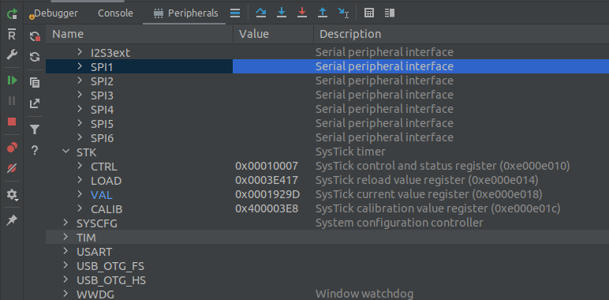

### Building the project

1. Open CLion
2. Open the HiveMind folder. Go in "File->Open", found the path to the root of the HiveMind repository and click "Open". After that step you should the project directory in the right of the screen. 
3. Configure the toolchain. This step selects the build tool and compiler for the CMake profile. Go in "File->Settings". On the right menu go in "Build, Execution, Deployment->Toolchains". Set all the fields as follows: 
4. Configure the Cmake profile. Go in "File->Settings". This step set the build type and select the toolchain file to build for the STM32H735ZG. On the right menu go in "Build, Execution, Deployment->CMake". Set all the fields as follow: You can copy the "Cmake options" line: `-D CMAKE_TOOLCHAIN_FILE=<path_to_hivemind_directory>/HiveMind/cmake/stm32_h735zg_gcc.cmake`
5. Build the project. In the right corner, in the target drop down menu (see image below) select the target named "hive_mind.elf". To build the project, just click on the green hammer next to the drop down menu. You can follow the building process in the "Message" tab console.

!!! Important
    Don't start the build if the cmake has not finished its job. You can follow the progress of the cmake job in the "CMake" console tabe at the bottom of the IDE. You can also follow the progress of the building process in the "Messages" tab.

### Flashing

Now the project can be build, the compiled code in the hive_mind.elf can be flashed on the STM32 MCU. Even if a target could be create to only flash the board, we gonna create a target that will be able to both flash and debug the board. Thanks to the support of OpenOCD in CLion, this integration should be easy.

1. Go in the target drop down menu where you selected the target "hive_mind.elf" and select "Edit Configurations" which should be the top item of the list.
2. In the top left conner of the new menu, click on the "+" that add a new configuration and select "OpenOCD Download & Run". 
3. Fill the fields like shown in the image above. Make sure to enter the path of hiveboard.cfg on your machine. It should be found at `<path_to_hivemind_directory>/HiveMind/tools/openocd/stm32_h7/hiveboard.cfg`
4. Plug the board like shown in the [Basic Examples](../../../user-guide/basic-examples/led-flash-buzz) except that you don't need the connection to a embedded computer to flash the board.
5. Flash the board. Since the CLion is now ready and the board is connected and powered, it's possible to flash the firmware.  In the right corner, in the target drop down menu (see image below) select the target named "flash" it should appear at the bottom of the list. It corresponds to the configuration created few steps above. You can then flash the board by clicking on the play button next to the configuration file. A console should open at the bottom of the IDE showing the status of the flashing process.

<figure markdown>
{align:"right"}
</figure>

!!! Hint
	The "Flash" target created in the steps above can also be used to build the code by clicking on the green hammer. Therefore, you don't need  to change the target to the "hive_mind.elf" to build the project anymore and can only use the "Flash" target. 

### Debugging

Since CLion supports well OpenOCD, the HiveMind firmware can easily be debugged from the CLion IDE.

1. If not done, follow the instructions in the "Building the project" and "Flashing" sections above. The target created at the step 2 and 3 of the "Flashing" section is used for debugging.
2. Select the target name "Flash" that was created in the steps above.
3. Connect and power the boards.
4. To start a debug session, click on the green bug icon on the right of the drop down list. (Look at the last image of the "Flashing " section). The "Debug" console should open and show the status of debug process by oppening a GDB port on port 3333.
5. From that point you can use the debugger with breakpoints in your code like any debugger in a IDE. The red rectangle below shows the main section of the debugger that you will likely use. 

#### Other debugging features

Two other features might be interested to use for debugging.

##### Internal registers display

The first one is to setup the STM32's .svd file in the debugger in order to visualize the value of the internal registers of the MCU. 

1. Go in the "Peripherals" tab (shown with an arrow in the above image presenting the debugger interface).
2. Click on the "Load .svd file. If the text option is not present, click on "Funnel" icon on the inner vertical column to the left of the console to configure the .svd files. 
   The path of the .svd for the STM32H7 should be found at `<path_to_hivemind_directory>/HiveMind/tools/svd_map/stm32h73x.svd`
3. Check the box of the upper most configuration to display all the available inner registers. Click Ok
4. Now, in the "Peripherals" tab you should see a list of registers. The next time you will be debugging, those registers should reflect the actual registers of the MCU.
    

##### RTOS analysis tool

The second feature that might be useful is the RTOS analysis tools. Since the HiveMind firmware uses [FreeRTOS](https://www.freertos.org/) to create tasks which act as virtual threads, it's interesting to view the callstack of each of those task separately instead of seeing the main thread of the MCU.  

1. Activate the RTOS integration. Go in "Files->Settings". Then go in "Build, Execution, Deployment - > Embedded Development->RTOS Integration". Check the box "Enable RTOS Integration" and select "Auto" of "FreeRTOS".
2. Next time in the debugging console you should see that you can select the callstack of the desired RTOS task you want. Also, you can see all the task and their status. 