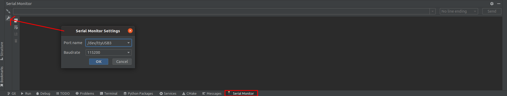
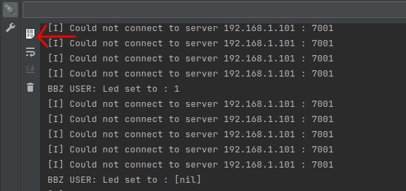

The HiveMind and the HiveConnect log different types of information through different serial ports. Thanks to the FTDI chips on the HiveBoard, all those ports are available through the single USB port of the board.  Although you can use your favourite programs like [screen](https://www.cyberciti.biz/hardware/5-linux-unix-commands-for-connecting-to-the-serial-console) or [Putty](https://www.putty.org/) to monitor what is happening on those serial ports, you can directly add a plug-in in CLion to do so.

1. Go in "Files->Settings". Go to the "Plugins" menu. Click in the tab "Marketplace" at the top of the menu and search for the "Serial Port Monitor" plugin by Dmitry Cherkas and install it.

2. Connect the USB cable from the board to the PC and power the board.

3. Connect to the serial port of the logging MCU. With step 1 completed, a new tab named "Serial Port" should be found in the consoles area. Click on the "Wrench" to configure the ports.
   Set the "Baudrate" to `115200`
   For the "Port name", it depends if you want to log information from the HivemMind or HiveConnect. 

   |  Port name   | Description                                                  |
   | :----------: | ------------------------------------------------------------ |
   | /dev/ttyUSB0 | JTAG of the STM32. Used to program the STM32. (Don't connect to this one) |
   | /dev/ttyUSB1 | JTAG of the ESP32. Used to program the ESP32. (Don't connect to this one) |
   | /dev/ttyUSB2 | Logging output of the HiveMind (STM32)                       |
   | /dev/ttyUSB3 | Logging output of the HiveConnect (ESP32)                    |

4. Once the Baudrate and the Port Name are set, connect to the port by clicking on the Connect Icon. 

   

   After this, you should see the console filling with a message from the selected board.

!!! Info
	If the messages are in hexadecimal instead of being in text, try to switch back to text mode by clicking on the button shown below. 

