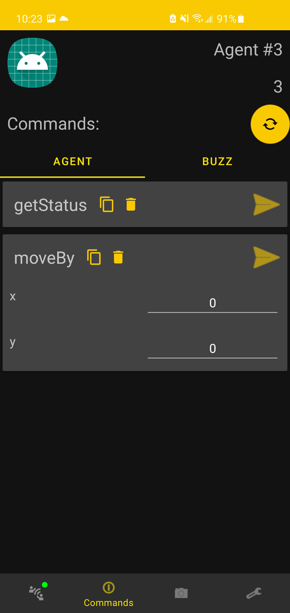

## Swarm agents commands: 
Agents in the same swarm than the android device are listed in this tab.

{: style="height:700px"}

If selected, commands specific to this agent are then listed and can be used to directly send command to this agent.

{: style="height:700px"}"

!!! Tip
    If an agent doesn't have its comands listed, it is possible to force to refresh its commands with the refresh button.

    Same goes for listing swarm agents.

### Commands in augmented reality
It is also possible to fetch and send commands directly from the augmented reality tab when targetting a specific agent.

Refer to [visualisation section](hivear-visualization.md) for more information on this view for any other questions other than commands.

{: style="height:700px"}"

!!! Attention
    Application only supports integer or float arguments modification for commands inside this view. 

    If any argument has another type, it is still possible to send from AR view, but with the already defined value. 
    If one wants to change that value, it can be edited inside the [agent commands view](hivear-commands.md#hivear-commands-swarm).

## Swarm broadcast commands: 
It is possible to send commands to all agents in the swarm. 
In order to register commands to broadcast, the user has to long click any commands from the agents commands view or device commands view and then accept.
Registered commands would then be separated between host and buzz command types and can both be send to any agents.

!!! Attention
    Not every sent broadcast command will be handled be every agents depending on whether the agent can handle this command.
    If an agent can't handle the command, it will simply discard it.

## Device buzz commands: 
As any other agent in the swarm, it is possible that the hiveboard connected to the android device has its own buzz commands registered.
It is from the tab named **Local Buzz** that the user can use those commands.

!!! Tip 
    Buzz commands can easily be recognized accross all the application with the following icon beside the command's name:

    
