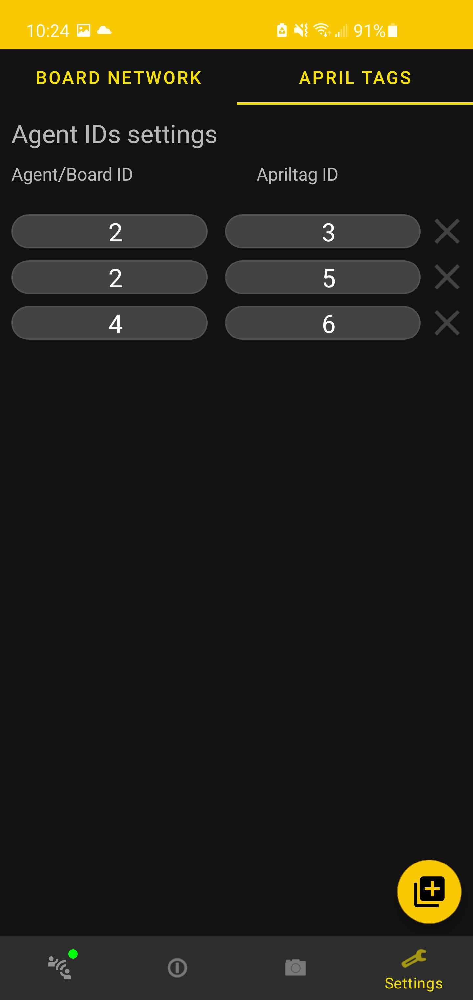

## Hiveboard network configuration
Please refer to [this section](../Networking/configure-wifi.md#setup-hiveboard-network-hivear) for information about setting the network configuration (such as SSID and password) of a Hiveboard.

## Associate april tags to an agent in the swarm: 
To use augmented reality, april tags must be use to identify swarm agents.
[April tags](https://april.eecs.umich.edu/software/apriltag) are incoded integers that are used as unique identifiers inside of HiveAR. 

By default, a tag's id will be associated to the same agent id. Hence, an april tag #1 will be considered attached to the swarm agent with id 1.
It is possible to override this behaviour by associating manually april tags with agent id.

In the settings tab, one can make any wanted associations for the session,

<figure markdown>
  {: style="height:700px"}

  <figcaption>Example of association</figcaption>

</figure>

!!! Tip
    One agent can have multiple different april tags associated with, or can have multiple physical april tag with same value on top of the agent.

!!! Attention
    It is **not** possible to associate the **same** april tag to **different** agents.