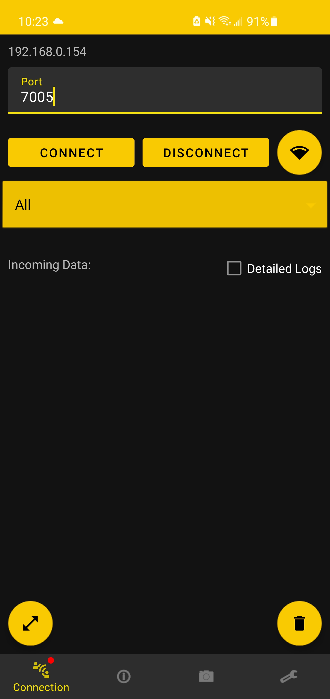
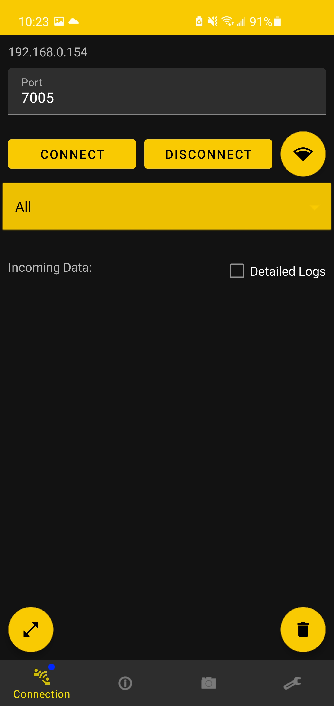
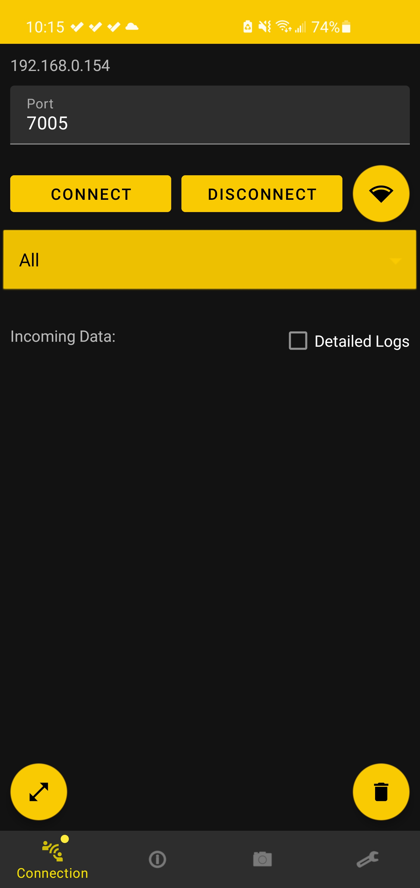
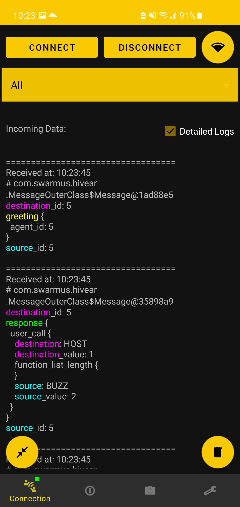

In order to use HiveAR, first download the application from the [GitHub](https://github.com/SwarmUS/HiveAR) page and install accordingly to the instructions in the same page.

## Swarm Connection
In the case of connecting HiveAR to a HiveBoard, whether a real or a simulated one, the user has access to connection settings in the Connection tab on the lower-left corner.
For more information on how to correctly connect a Hiveboard to the android device running HiveAR, please refer [this section](../Networking/configure-wifi.md#connect-hiveboard-hivear).

### Connection Status
As the Android device must be connected either by USB or TCP to communicate to the swarm, it is possible to keep track of the state of the connection with the swarm.

A small round icon has been add to the connection tab icon and can be observed as followed:
The round icon can represent four possible states:

- Red: Android device not connected
- Blue: Android device trying to establish connection with HiveMind
- Yellow: Android device connected to HiveMind, but HiveAR is not registered as part of the swarm
- Green: Android device is connected to HiveMind **And** HiveAR registered as part of the swarm

<figure markdown>
  {: style="height:700px"}

  <figcaption>Not connected status indicator</figcaption>

</figure>
<figure markdown>
  {: style="height:700px"}

  <figcaption>Connecting to HiveMind status indicator</figcaption>

</figure>
<figure markdown>
  {: style="height:700px"}

  <figcaption>Connected, HiveAR not registered in swarm</figcaption>

</figure>
<figure markdown>
  {: style="height:700px"}

  <figcaption>Connected to swarm, with logs</figcaption>

</figure>

!!! Attention
    Always make sure connection with the swarm is established and working correctly (green round icon) before trying to use any swarm features. 
    
    In the case where there is a problem with the connection, one can always return to the connection page to try to establish the connection again.
