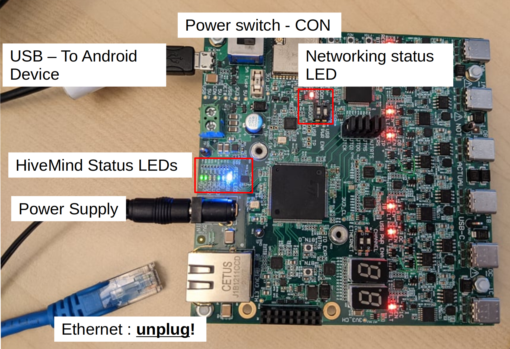
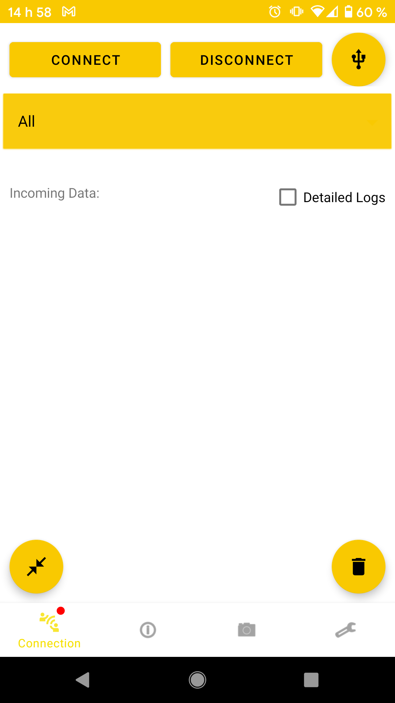
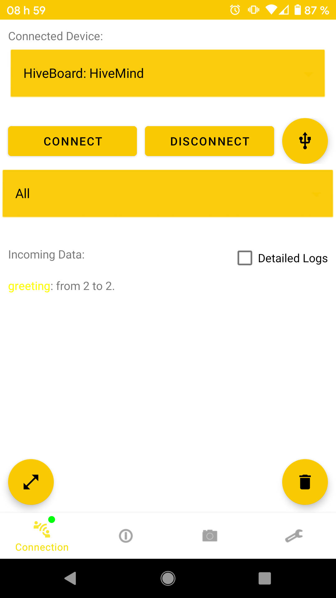

In order to use HiveAR, first download the application from the [GitHub](https://github.com/SwarmUS/HiveAR) page and install accordingly to the instructions in the same page.

## Connect the Android Device to a physical HiveBoard

### Wire Things Up

To connect the HiveAR app running on an Android device to a HiveBoard, **you must first disconnect the Ethernet cable from the HiveBoard**. Then, plug the micro-USB cable from the HiveBoard to the Android Device as shown in the image below.

Also, make sure that the DIP switches for the WROOM ESP-32 module are at the correct position to enable Wi-Fi capabilities. Refer to the [HiveBoard UI page](../../hardware/HiveBoard/hiveboard-ui.md#dip-switches) for more on this.

!!! hint 
    **Why must the Ethernet cable be disconnected?**

    A HiveBoard can only be connected to one host at a time (be it a robot runnung [HiveMindBridge](https://github.com/SwarmUS/HiveMindBridge), usually connected vie Ethernet, or an Android device running HiveAR). If the HiveBoard and the robot's embedded computer already have a connection established, it will be impossible to establish a second connection to the Android device. Thus, we advise that you unplug the Ethernet cable prior to using HiveAR with a given HiveBoard.

### Establish the connection between HiveAR and HiveMind via USB

Launch the HiveAR application on the Android device. Accept the different permission requests.

Navigate to the Connection tab (first icon on the left at the base of the screen).

<figure markdown>
{: style="height:700px" }
</figure>

Click on the circular button containing two arrows pointing at each other in the lower left side of the screen. A selection bar will appear at the top of the screen:

<figure markdown>
{: style="height:700px;align:left" }
</figure>

Tap on the bar and select option `HiveBoard: HiveMind`. Then tap Connect. The logs (under `Incoming Data`) should show that the greet messages have been exchanged and you should see a green dot appear near the Connection button at the lower left of the screen. HiveAR and HiveMind are now connected.

<figure markdown>
{: style="height:700px;align:left" }
</figure>

## Connect the Android Device to a Simulated HiveBoard

TODO

## Connection Status
As the Android device must be connected either by USB or TCP to communicate to the swarm, it is possible to keep track of the state of the connection with the swarm.

A small coloured dot has been add to the connection tab icon and can be observed as followed:
The dot can have four states:

- Red: Android device not connected
- Blue: Android device trying to establish connection with HiveMind
- Yellow: Android device connected to HiveMind, but HiveAR is not registered as part of the swarm
- Green: Android device is connected to HiveMind **And** HiveAR registered as part of the swarm

<figure markdown>
  {: style="height:700px"}

  <figcaption>Not connected status indicator</figcaption>

</figure>
<figure markdown>
  {: style="height:700px"}

  <figcaption>Connecting to HiveMind status indicator</figcaption>

</figure>
<figure markdown>
  {: style="height:700px"}

  <figcaption>Connected, HiveAR not registered in swarm</figcaption>

</figure>
<figure markdown>
  {: style="height:700px"}

  <figcaption>Connected to swarm, with logs</figcaption>

</figure>

!!! Attention
    Always make sure connection with the swarm is established and working correctly (green round icon) before trying to use any swarm features. 
    
    In the case where there is a problem with the connection, one can always return to the connection page to try to establish the connection again.
