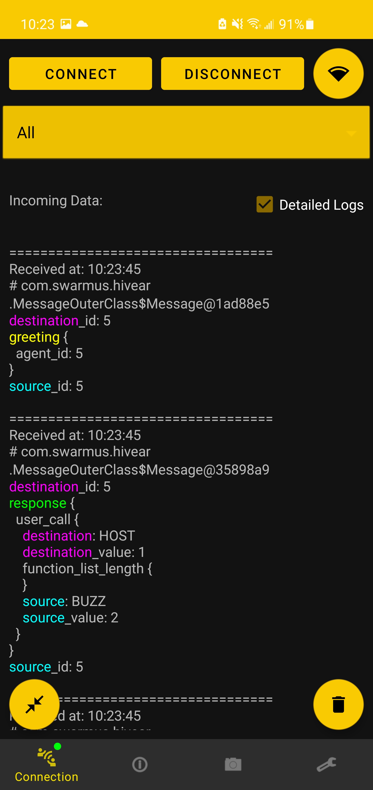

One of the main goal of the Android app is to visualize the state of the Swarm directly from the HiveAR app.

## Augmented Reality (AR): 

Augmented Reality is a quick diagnostic tool that is used mostly to get the immediate state of visible agents, but also to send commands to specific agents.
At a close range, if the device is pointed towards the [april tag](https://april.eecs.umich.edu/software/apriltag) on top of a specific agent, details of this agent will appear on top of it.<!--add reference or detail what this is--> 

Information contained in that view are:

- Last time agent was updated
- Status of the agent (User most define the comportement as it can differs from one agent to another)
- Last commands sent from the Android device to the agent
- Commands associated to the selected agent that can be sent

<figure markdown>
  {: style="height:700px"}

  <figcaption>AR agent selected example</figcaption>

</figure>

It is possible to have an AR marker in the space without being on top of an agent if this agent has moved and the android device hasn't detect it.
It will still monitor the agent even if it is not on top of it, but if one desire to remove the marker, simply long click it and agree to remove it.

!!! Tip
    If multiple agents are detected, it is possible to focus on one by clicking its corresponding AR marker. (arrow)

## Messages Logging: 

Logs are a great way to know what information came from or to the Android device.
They can be found in the Connection tab.
They can help to see if a command came through, or what were the arguments of the incoming function call.

<figure markdown>
  {: style="height:700px"}

</figure>

!!! Tip
    Logs can be shortened or detailed whenever needed with the "Detailed logs" checkbox.