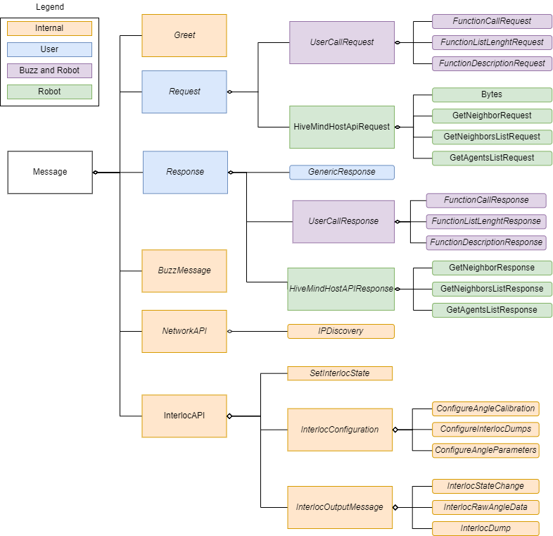

# HiveMind API

The HiveMind provides an API via protobuf for the host which allows it to get information on the swarm (neighbors, swarmlist, distance of a neighbor, etc), act on it or more. Most of the swarm decisions should be made via the Buzz script to separate the logic of the swarm and its action on the world. However, sometimes more computing power can be requried, which can be done on the host if needed. Thus the host has acces to an API.

!!! note
    The HiveMind API is implemented as a set of [Protocol Buffer](https://developers.google.com/protocol-buffers) messages. This means that any program could interact with the HiveMind API, as long as it uses the same message definition. For instance, in the SwarmUS platform, [HiveMindBridge](https://github.com/SwarmUS/HiveMindBridge), [HiveConnect](https://github.com/SwarmUS/HiveConnect), [HiveAR](https://github.com/SwarmUS/HiveAR), and the [Python testbench](https://github.com/SwarmUS/TestBench-Python) use the HiveMind API.
    
    The messages for HiveMind API are defined in the [Pheromones repository](https://github.com/SwarmUS/Pheromones).

    In the SwarmUS codebase, the Pheromones message definitions have been further wrapped for C++ specifically, since this is the language used in most of the stack. The C++ wrapping is included in the [Propolis repository](https://github.com/SwarmUS/Propolis) as the `propolis-pheromones` library.

Note that the host should only use a subset of the messages. The whole message hierarchy is provided for a better understanding of the inner workings. **Only the Request and Response messages (and those composed in it) are for the user/host to call, the others are internal messages for swarm functionalities.**

Here is the message hierarchy:

Here is a description of the Messages:

- Request and Response: 
  Requests and Reponses available for the user.

    - GenericResponse: 
      A generic response can be used to indicate success or failure. The details field can be used to log on the other side. When there is no payload on a request, a GenericResponse is used as an ACK.

    - UserCall: 
      Regroup multiple messages. All UserCalls can be to/from Buzz or the host.

        - FunctionCall: 
          Used to call a function to a host or Buzz script. The function name needs to match the one that was registered, the number of arguments and their types needs to match. 

        - FunctionListLength: 
          Used to get the total number of registered functions. See [FunctionDescription](#FunctionDescription)

        - FunctionDescription: 
          To obtain the description of a function, such as its name, number of arguments, arguments name and the arguments types. Note that you access function descriptions by list index, which starts at 0. So if the function list length is 5, the valid list indexes are [0,1,2,3,4].

    - HiveMindHostAPI: 
      API that the HiveMind exposes to the host, this includes an API for the interlocalisation, bytes and swarmlist

          - Bytes: 
            A request used to send bytes, ACK with a generic response. Note that each Bytes message is a packet of a bigger payload, you can reassemble the total packet with the packet id, packet number and a boolean that identifies the last packet. You need to concatenate the data to get the original byte stream.

          - Neighbor: 
            Get the information on a particular neighbor (distance, orientation, line of sight).

          - NeighborsList: 
            Get a list of ids containing the current neighbors. Note that you only get their id, you need to make a [Neighbor Request](#Neighbor) to obtain the data.

          - SwarmList: 
            Get a list of ids containing the current agents in the swarm.

- Greeting: 
  The first message sent to the HiveMind needs to be a greet (can be with garbage value). The HiveMind will reply with a Greet with its ID, allowing the host to know its id in the swarm. This is required to make requests in the swarm. The greeting should be the first thing to be sent on connection.

- NetworkAPI: 
  Internal message to manage connections with other members in the swarm. Not relevant to the user.

    - IpDiscovery: 
      Used to discover new IP addresses in the network.

- InterlocAPI: 
  Messages internal to the interlocalisation. You can calibrate your setup using the [CalibrationMessage](#CalibrationMessage) You can use [PythonTool](https://github.com/SwarmUS/PythonTool/tree/master) which is a small wrapper in python, allowing the calibration for the interlocalisation.

    - CalibrationMessage: 
      Used for calibration of the physical setup for the interlocalisation.

    - SetCalibrationDistance: 
      Set the calibration distance.

    - StartCalibration: 
      Starts the calibration.

    - StopCalibration: 
      Stops the calibration

    - CalibrationEnded: 
      ACK on the ending of the calibration

- BuzzMessage: 
  Internal message to Buzz to share data between the virtual machines in the swarm.