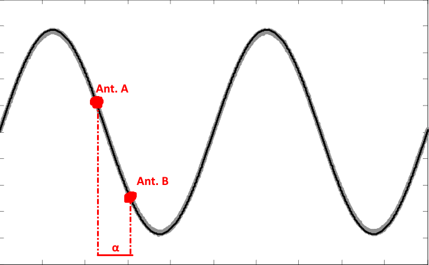
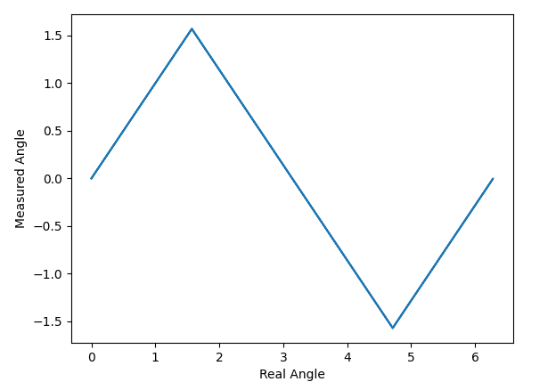
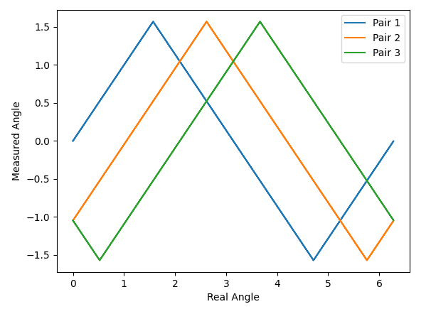
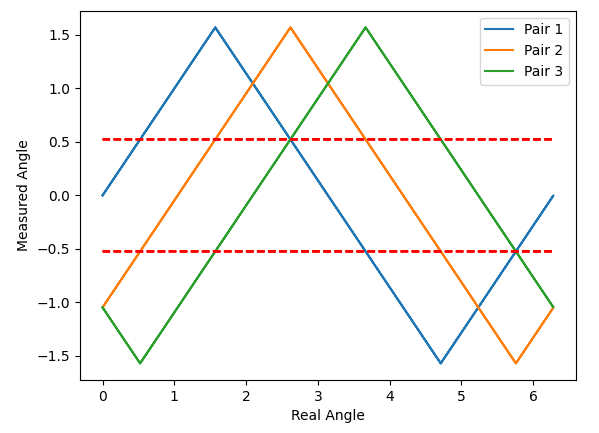
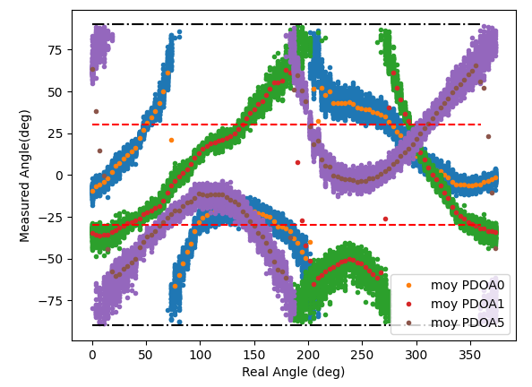
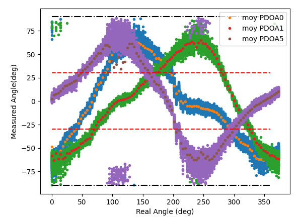
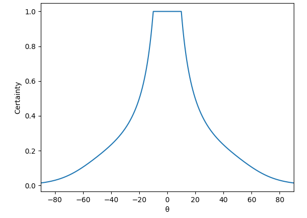
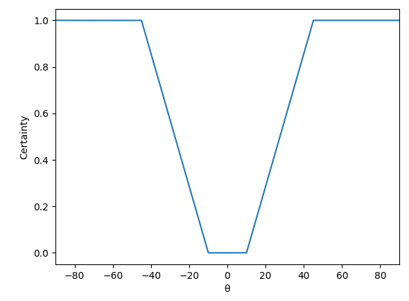

# Angle Measurement

## Theory

Before explaining how angle measurement is done in the HiveMind, lets take a few steps back and see some of the theoretical fundametals (in a 2-antenna scenario) used in the calculation.

Because antennas in the system are so close to each other (2.7 cm), it is not possible to rely solely on timestamping messages received at different antennas to evaluate an angle. At 2.7 cm (the maximum time difference), radio waves only take 90 ps to travel. The DW1000 can timestamp with a 15 ps accuracy. When accounting for noise we can see that the time difference will be almost no use to estimate an angle with certainty.

The solution is to calculate a phase difference ($\alpha$) instead of a time difference. The antennas are placed at less then a wavelength (3.5 cm) appart. This way, the radio wave will hit each antenna at a different moment all while staying within the same period (because a period spans a distance of $\lambda/2$).

<figure markdown>
  {width="500"}
  <figcaption>Phase Difference</figcaption>
</figure>

Knowing the phase difference and doing a little trigonometry, the angle of arrival (AoA) can be calculated:
$$
\theta = arcsin\left(\frac{\alpha}{\pi}\right)
$$

Calculating $\alpha$ can be done by using registers found in the DW1000. The user is refered to the [DW1000 User Manual](https://www.decawave.com/sites/default/files/resources/dw1000_user_manual_2.11.pdf) and [an article](https://www.decawave.com/sites/default/files/angle_of_arrival_estimation_using_dw1000_online.pdf) published by DecaWave on the subject.

$$
\alpha = \left(\left( \phi_A - \beta_A - \phi_B + \beta_B + \pi \right) mod 2\pi \right) - \pi
$$

Where $\phi$ is the synchronization frame angle (SFD) and $\beta$ is the first path angle (FP). 

The $arcsin()$ in the equation allows a one-to-one linear mapping of phase differences from $-\pi/2$ to $\pi/2$ to angles going from $-\pi/2$ to $\pi/2$. To bring the mapping to angles between $0$ and $\pi$, an offset is added to the equation presented earlier:
$$
\alpha = \left(\left( \phi_A - \beta_A - \phi_B + \beta_B - \frac{\pi}{2} \right) mod 2\pi \right) - \pi
$$

The problem with this approach is that a one-to-one mapping is only available from $-\pi/2$ to $\pi/2$ (or $\pi/2$ to $3\pi/2$ in the following figure). For the second half of the circle, the same values come back, only mirrored, making it impossible to determine what the actual angle is.
<figure markdown>
  
  <figcaption>Angle measurement with a single antenna pair</figcaption>
</figure>

## Expanding Beyond 180°

To be able to measure the angle of arrival on the whole unit circle, three antennas must be used. By placing antennas in an equilateral triangle, we can calculate the AoA for each of the three antenna pairs which will all be offset by 60°

<figure markdown>
  
  <figcaption>Angle measurement with multiple antenna pairs</figcaption>
</figure>

The problem of knowing which mapping (the downwards or upwards slople) to use for each pair is still present. However, by using information from the two other pairs, it is possible to know which slope to choose. By placing imaginary lines at +/- 30°, we can use the AoA value of another antenna pair to know which slope to use for the current pair.

!!!note
    Don't forget the x-axis is the **real** angle. So what we are measuring is a point on the y-axis to which we are trying to map a point on the x-axis.

<figure markdown>
  
  <figcaption>Choosing the correct slope</figcaption>
</figure>

For example, take pair 1. The rising slope should be chosen when pair 2 **or** pair 3 is below the -30° line while the falling slope should be chosen when pair 2 **or** pair 3 is above the +30° line. At any given angle, only one curve can be measured between the two lines. This gives a way to know with certainty *(in theory)* which slope to use for all three of the pairs. By applying the correct slope, the real angle can be calculated. In an ideal scenario, calculating the angle for each of the three pairs will yield the same result.

<!--
This gives way to the following simple algorithm to calculate an angle:

1. Read the same message on all three DW1000s
2. For each DW1000 extract the SFD Angle ($\beta$) and the FP angle ($\phi$)
3. Compute the phase difference for each antenna pair: $\alpha = \left(\left( \phi_A - \beta_A - \phi_B + \beta_B - \frac{\pi}{2} \right) mod 2\pi \right) - \pi$
4. Linearize the three phase differences: $\theta = arcsin\left(\frac{\alpha}{\pi}\right)$
5. Using the three $\theta$s, choose the rising or falling slope for each antenna pair
6. Apply the chosen 

-->

## Implementation & Certainty
### Real World Data
Of course, when taking into acount the real world and noise, the data is not as clean as presented earlier, making it a little harder to calculate an angle. The first thing we notice is that all the curves are offset from their theoretical by a certain amount.

<figure markdown>
  
  <figcaption>Offset in PDoA data</figcaption>
</figure>

The good news is that this offset is constant. It is due to the clock skew (difference in travel length) present in the system. This skew does not change unless a component in the system (cable, BeeBoard, etc.) is changed. This is why a *per-system* calibration is done.

After applying a correction for the offset, the data does start to look like the theoretical model presented earlier.

<figure markdown>
  
  <figcaption>Offset correction</figcaption>
</figure>

!!!note
    You may notice that some of the data points tend to wrap around (the effect is pretty obvious at 0° and 100°). This is the main cause of errors in the system as having data on the wrong side of the +/- 30° line makes us choose the wrong slope to modelise the data.

The equation to calculate the phase difference ($\alpha$) must be changed to take this offset ($z$) into account:
$$
\alpha_{corrected} = \left(\left( \phi_A - \beta_A - \phi_B + \beta_B - \frac{\pi}{2} + z \right) mod 2\pi \right) - \pi
$$

Each antenna pair is then modelised with two linear equations of the form $y = ax + b$ with one positive and one negative slope. Even for curves where three slopes are visible (for example the purple curve), only two slopes are needed as the third one is the prolongation of the first one modulo 360°.

### Calculating a Single Angle
In the [previous section](#expanding-beyond-180), we mentioned that the algorithm would return the same angle for any of the three antenna pairs. Although the real world data is close to theory, it is not perfect and each antenna pair will yield a different angle. Actually, it might even yield an angle pretty far from reality if the wrong slope is chosen because of the +/- 30° decision line.

Because of this, a choice was made to have the algorithm produce six different angle possibilties (two for each antenna pair) as well as a certainty estimation for each possibility. A weighted average of the results then produces a single angle value.

!!! note
    The certainty calculation was made as a way to facilitate the integration of the angle measurement in a Kalman filter. All six results don't go up through the whole software stack, but they are accessible in the file `AngleCalculator.cpp` if such a filter is to be implemented.

The certainty calculation is made throughout the algorithm multiplying certainties at each step as a way to have multiple factors taken into account. Let's go trough the algorithm step by step and explain what is done in each of them.

**1. Calculate $\theta$ for every antenna pair.**

Activate all three DW1000s in RX mode and receive the same message on the three antennas (see [synchronization](sync.md) for more information). Extract the data from the registers of each DW1000 and compute $\alpha$ and $\theta$. 
$$
\alpha_{corrected} = \left(\left( \phi_A - \beta_A - \phi_B + \beta_B - \frac{\pi}{2} + z \right) mod 2\pi \right) - \pi
$$
$$
\theta = arcsin\left(\frac{\alpha_{corrected}}{\pi}\right)
$$

$\theta$ gives us a point on the y-axis of the previous graphs. In order to reduce the standard deviation of the data, multiple (currently 10) messages are received and the mean of all $\theta$s of the same antenna pair is taken as the actual $\theta$.

**2. Compute $\theta$ certainty**

Because the spread of data is larger for $\theta$ values nearing +/- 90° and this is where wrap-arounds happen, the certainty for each $\theta$ value is calculated according to the following curve:

<figure markdown>
  
  <figcaption>Certainty of θ value</figcaption>
</figure>

Following this, we have three values of $\theta$ each with their certainty.

**3. Compute slope certainty**

The next step is to choose which slope to use for each antenna pair according to the +/- 30° decision line. This is done using what was called the decision matrix. The matrix tells us what slope to choose if another antenna pair has a $\theta$ value **above** the 30° decision line.

$$
    \begin{bmatrix}
      X && F && R \\\
      R && X && R \\\
      F && F && X
    \end{bmatrix}
$$

For example, for antenna pair 0 (first line), if antenna pair 1 (second column) has a $\theta$ value greater than 30°, the falling slope should be chosen. On the other hand if antenna pair 2 (third column) has a $\theta$ value greater than 30° it is the rising slope that should be used. 

The inverse matrix also exists telling us the slope to choose if the other pairs have values **under** the -30° decision line.

A certainty of being above or below 30° is therefore computed for each antenna pair.
<figure markdown>
  
  <figcaption>Certainty of decision line</figcaption>
</figure>

The certainty is multiplied with the certainty of the $\theta$ value previously calculated. The certainty of each slope for each antenna pair is computed using the decision matrix.

For example if calculating slope certainties for pair 0, if we have $\theta_1 = 60°$ and $\theta_2 = 25°$, the certainties of being **above** the 30° line would be around 1 and 0.3 while the certainties of being **below** the line are both 0. The decision matrix tells us that $\theta_1 > 30°$ means a falling slope and $\theta_2 > 30°$ means a rising slope. We would then have the certainty of choosing the falling slope being 1 and the certainty of choosing the rising slope being 0.3. Of course this is a pretty drastic example, normally both values tend to agree on the same slope. (When there are two certainties of choosing the same slope, the maximum of both values is taken)

This operation is done for every antenna pair giving us rising and falling slope certainties for each of the three pairs.

**4. Apply the linear fit**

For each pair, both linear fits (rising and falling) are applied using the reciprocal function (because we are trying to map a calculated angle (y-axis) to a real angle (x-axis)):
$$
  Angle = (\theta - b) / a
$$

The certainty value of the angle is the certainty of the slope multiplied by the certainty of the $\theta$ value. This gives us six different angle and certainty values.

**5. Reduce everything down to a single result**

In order to return a single angle, a small algorithm checks if two values in the six are within a margin of error of each other. If this is the case, there is a good chance that those values are the actual angle and a weighted average of the two angles with their certainties is done. If no values are close of each other, a weighted average of all six values and their certainties is done.