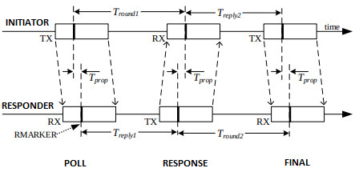
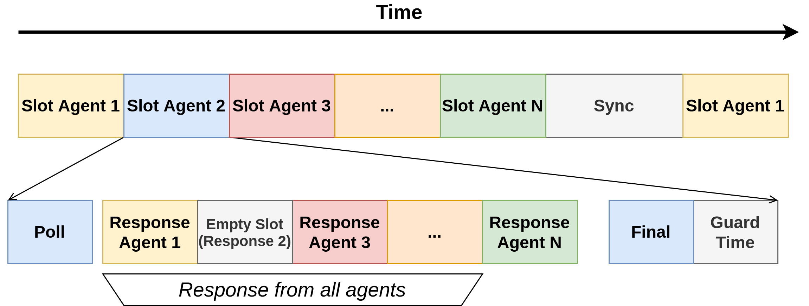

# Distance Measurement

Distance measurement is done using the [two-way ranging algorithm](#two-way-ranging-algorithm) as described in the [DW1000 User Manual (Appendix 3)](https://www.decawave.com/sites/default/files/resources/dw1000_user_manual_2.11.pdf). The following section is meant as a quick reference in order to understand the need for all messages sent in the system and how they are organized using the [synchronization state machine](sync.md).

## Two-Way Ranging Algorithm

In short, the two-way ranging (TWR) algorithm works by timing how long a message takes to travel from one antenna to the other. Knowing the speed of light, a distance measurement can then be derived.

In order to understand how TWR works, one must know the following features of UWB communication with the DW1000 heavily used in the algorithm:

* UWB packets are sent using very time constrained pulses. This allows precisely timestamping received messages as well as differentiate the first path (line of sight) signal from other signals when the radio waves bounce around walls or other obstacles.
* The DW1000 can also timestamp when messages are transmitted and even send messages at a specific timestamp.
* Messages are always timestamped at the same place, called the RMARKER at the beginning of a transmission. This way, the length of a message has no impact on the ability to timestamp it.

!!! note 
    Timestamps on the DW1000 can be quite tricky to understand as RX and TX timestamps are not done exactly at the same moment and the antenna delay must be taken into account. Before tweaking anything in the algorithm, the user should read sections 3.2, 3.3 and 4.1.6 of the [DW1000 User Manual](https://www.decawave.com/sites/default/files/resources/dw1000_user_manual_2.11.pdf).

### One-to-One

TWR could be done using as few as two messages. However, in order the minimize the error induced by the difference in clock frequency between HiveBoards, a three-message scheme known as Asymmetric Double-Sided Two-Way Ranging is used. 

This scheme is based around two devices (the Initiator and the Responder) as well as three messages (Poll, Response and Final).

1. 
   The Initiator starts by sending the Poll message at a given time (**poll_tx_ts**). The Responder receives the message and timestamps it (**poll_rx_ts**).
2. 
   The Responder sends the Response message back to the Initator at time (**resp_tx_ts**). The Initiator timestamps the message (**resp_rx_ts**).
3. 
   The Initiator decides a timestamp at which to send the Final message and starts a *delay send* operation. This allows to insert the timestamp at which the message will be sent (**final_tx_ts**) inside the message itself. The Final message is the only one containing a useful payload comprised of all timestamps the Initiator knows:

      * **poll_tx_ts**
      * **resp_rx_ts**
      * **final_tx_ts**
  
    The responder then has all six timestamps (RX and TX for three messages) in hand allowing it to calculate the average time of flight (ToF) of messages using the following figure and equations.

!!! error
    Change figure to show Initiator, Responder and Poll, Resp, FInal
    

$$
ToF = \frac{T_{round1} \cdot T_{round2} - T_{reply1} \cdot T_{reply2}}{T_{round1} + T_{round2} + T_{reply1} + T_{reply2}}
$$

Where
$$
T_{round1} = resp\\_rx\\_ts - poll\\_tx\\_ts
$$

$$
T_{round2} = final\_rx\_ts - resp\_tx\_ts
$$

$$
T_{reply1} = resp\_tx\_ts - poll\_rx\_ts
$$

$$
T_{reply2} = final\_tx\_ts - resp\_rx\_ts
$$

After performing the calculation, the Responder then knows the distance seperating it from the Initiator. (The inverse is not true. The Initiator does not have all timestamps required to calculate the distance).

### One-to-Many

The drawback of the one-to-one algorithm is that, in a multi-agent scenario, three messages must be sent for each agent to know their distance to a single other robot. The number of messages for every agent to know it's distance from every other agent grows factorially thus decreasing the refresh rate of the whole system:
$$
N_{messages} = 3 \cdot \frac{N_{agents}!}{2\cdot(N_{agents}-2)!}
$$

Instead of having every agent perform a 1:1 TWR with every other agent, the scheme presented previously is extended to allow multiple Responders. Instead of having one Initiator and one Responder, we have one Initiator and $N-1$ Responders (every agent except for the Initiator). The message exchange is then very similar to the 1:1 scenario:

1. The initiator send the Init message which is received by all Responders simultaneously.
2. Each Responder, in turns, sends the Response message. The Initiator receives all the messages and timestamps them all.
3. The Initiator sends the final message now containing $N$ response_rx_ts, one for each Responder.
   
Each Responder then has the six timestamps needed to compute their distance from the Initiator. After $2 + N$ messages, all the agents, other than the Initiator, have updated their distance from the Initiator. Each agent then takes turns becoming the Initiator every time allowing all other agents to update their position from the Initiator. The sequence is summarized in the following figure.

More details on this time-slotting can be found in the [synchronisation page](sync.md). 

## Further Reading

The following application notes produced by Decawave can be read in order to understand the used algorithm, but also as a way to learn about different algorithms that could be implemented as well as corrections for non line-of-sight operation and calibrations in order to achieve maximum accuracy.

* [Application Note APS006 - Part 1 Channel Effects on Range Accuracy](https://www.decawave.com/wp-content/uploads/2018/10/APS006_Part-1-Channel-Effects-on-Range-Accuracy_v1.03.pdf)
* [Application Note APS006 - Part 2 NLOS Operation and Optimizations](https://www.decawave.com/wp-content/uploads/2018/10/APS006_Part-2-NLOS-Operation-and-Optimizations_v1.5.pdf)
* [Application Note APS006 - Part 3 DW1000 Diagnostics for NLOS Channels](https://www.decawave.com/wp-content/uploads/2018/10/APS006_Part-3-DW1000-Diagnostics-for-NLOS-Channels_v1.1.pdf)
* [Application Note APS011 - Sources of Error in Two Way Ranging](https://www.decawave.com/wp-content/uploads/2018/10/APS011_Sources-of-Error-in-Two-Way-Ranging-Schemes_v1.1.pdf)
* [Application Note APS013 - The Implementation of Two-Way Ranging with he DW1000](https://www.decawave.com/wp-content/uploads/2018/10/APS013_The-Implementation-of-Two-Way-Ranging-with-the-DW1000_v2.3.pdf)
* [Application Note APS014 - Antennna Delay Calibration](https://www.decawave.com/wp-content/uploads/2018/10/APS014_Antennna-Delay-Calibration_V1.2.pdf)