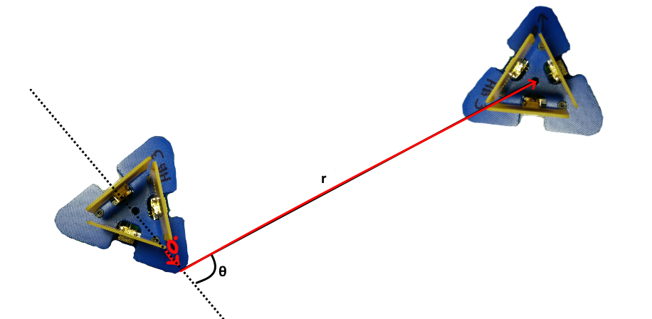
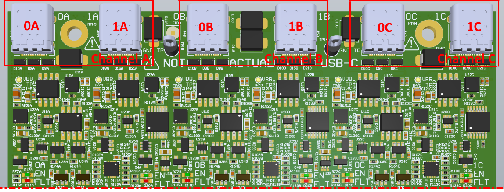
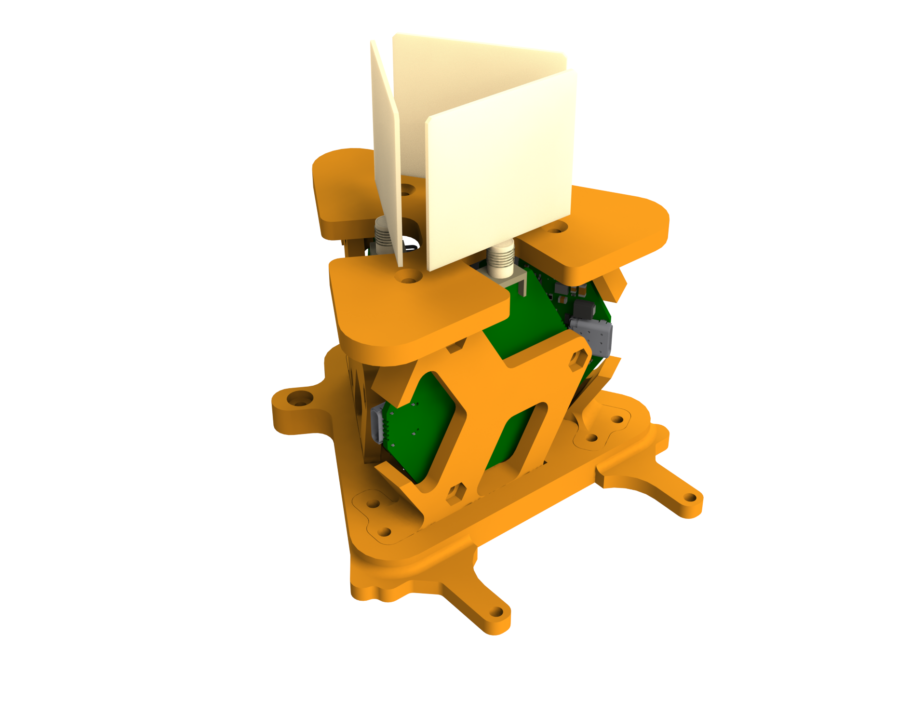
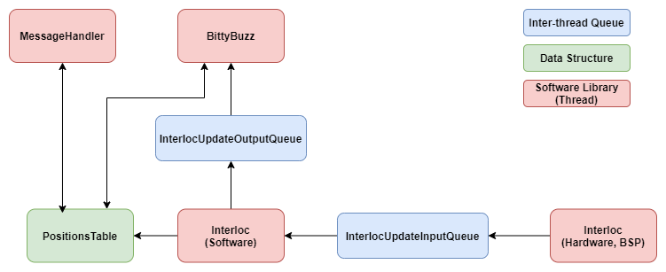

# Interlocalisation - Introduction
Interlocalisation is the feature allowing a HiveBoard-BeeBoard assembly to calculate its distance and angle to other HiveBoards. The distance is defined as the norm of the straight 3D line connecting two HiveBoards (if there is an elevation difference between both boards, this will show up in the distance measurement) while the angle (sometimes called azimuth) is the relative bearing of another HiveBoard with regards to the first. No elevation measurement is done, the system can therefore only work properly on a 2D plane. The following figure shows those two concepts with the distance marked $r$ and the angle $\theta$.

<figure markdown>
  {width="600"}
  <figcaption>Interlocalisation Concepts</figcaption>
</figure>

!!!info
    The 0° location of a BeeBoard assembly is chosen during [calibration](../calibrating_a_hiveboard.md). This way, it is always possible to align the 0° of the interlocalisation engine with the front of the robot on which it is mounted.

All measurements done by the interlocalisation engine are made available through [Buzz's neighbor structure](https://github.com/buzz-lang/Buzz/blob/master/doc/api.md#neighbors) or via the [HiveMind's API](../../HiveMind/hivemind-api.md).

The following page gives a brief overview of how the system is organized from a hardware and software point of view. Other pages explain how [distances are calculated](distance.md), how [angles are calculated](angle.md) and how all messages are [synchronized between all HiveBoards](sync.md).

## Hardware
The interlocalisation feature is based around [Decawave's DW1000 UWB chip](https://www.decawave.com/sites/default/files/resources/dw1000-datasheet-v2.09.pdf). Each [BeeBoard](../../../hardware/BeeBoard/BeeBoard_V1.000.md) contains a single DW1000. To be able to calculate distances between two systems, a single BeeBoard is needed. On the other hand, in order to calculate angles, three BeeBoards must be plugged into a HiveBoard. One BeeBoard should be plugged into each of the HiveBoard's channels (A, B and C). Whether the BeeBoard is plugged into port 0 or 1 has no impact.

<figure markdown>
  
  <figcaption>HiveBoard Ports</figcaption>
</figure>

!!!note
    The BeeBoard plugged into channel B will act as the master in all exchanges. This means that distances and angles will be calculated relative to that specific BeeBoard. Because the boards are so close to each other, this has practically no impact.

The BeeBoards must then be placed in a specific pattern using the holder found in the [HiveBoard-BeeBoard-Mechanical GitHub repository](https://github.com/SwarmUS/HiveBoard-BeeBoard-Mechanical) and the whole system must be [calibrated](../calibrating_a_hiveboard.md). 

<figure markdown>
  {width="400"}
  <figcaption>BeeBoard Holder</figcaption>
</figure>

!!!important
    Calibrations are very sensitive to all elements involved in the assembly. Therefore, a new calibration must be done for any change in components (HiveBoard, BeeBoard, USB-C cable, port in which the BeeBoard is plugged, etc.)

## Software Architecture
In the [HiveMind firmware](https://github.com/SwarmUS/HiveMind), interlocalisation is split between multiple threads and libraries. In the `BSP` library, the measurements themselves are done. The `BSP` library is different for each compilation target. For a microcontroller build, [the library](https://github.com/SwarmUS/HiveMind/tree/master/src/bsp/src/stm32/src/interloc) is responsible for sending/receiving messages and calculating a distance and an angle. While for a ROS build, [the library](https://github.com/SwarmUS/HiveMind/blob/master/src/bsp/src/posix/src/InterlocManager.cpp) gets interlocalisation information from Gazebo and doesn't have any communication to handle.

Measurements done in this low-level library are then pushed to the `InterlocUpdateInputQueue`. This queue feeds the `Interloc` library which is a high-level library responsible for filtering and storing interlocalisation data. Each time an update is pushed to the queue, a thread picks it up, filters it and updates the specific neighbor's position in the `PositionsTable`. A message is also sent to Buzz via the `InterlocUpdateOutputQueue` to notify it that an updated position is available for a given neighbor.

Filtering of values is done using a very simple [exponential moving average filter](https://en.wikipedia.org/wiki/Moving_average#Exponential_moving_average).
$$
FilteredValue_t = \alpha \cdot UnfilteredValue_t + (1-\alpha) \cdot FilteredValue_{t-1}
$$

!!!note
    For better results, this filter should be changed for something like a Kalman filter or a particle filter.

<figure markdown>
  
  <figcaption>Interlocalisation Software Architecture</figcaption>
</figure>

## Usage
As shown in the previous figure, interlocalisation data can be accessed via [Buzz's neighbor structure](https://github.com/buzz-lang/Buzz/blob/master/doc/api.md#neighbors) or the [MessageHandler (HiveMind API)](../../HiveMind/hivemind-api.md). 

The message handler allows accessing more than the current calculated positions. It is possible to get the raw data used to calculate angles or get periodic dumps of all calculated positions. These features are mainly used for calibration and characterization purposes and examples on their usage can be found in the [TestBench-Python repository](https://github.com/SwarmUS/TestBench-Python).