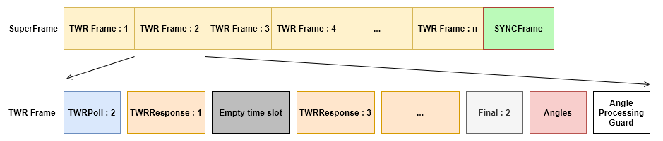
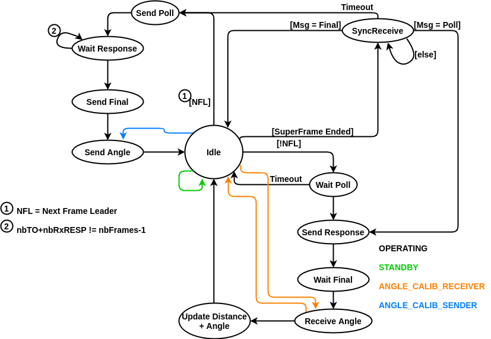

# Synchronization

Synchronization of all agents between each other is used in order to have each agent send the correct message over UWB at the correct time. The [Distance Measurement](distance.md) and [Angle Measurement](angle.md) sections should be read before continuing in order to understand all the messages and their sequencing required to calculate distances and angles.

## Time-Slotting Overview

As introduced in [Distance Measurement](distance.md), each agent must, in turns, become the initiator in a two-way ranging (TWR) sequence for all other agents to update their knowledge of the initiator's position. In order to accumulate enough messages to calculate an angle as described in [Angle Measurement](angle.md), an *Angle* section is added to each frame in which the initiator sends messages at a constant rate until enough messages are sent for the responders to be able to calculate an angle.

!!!note ""
    The following figure is not to scale in regards to timings. See [Timings](#timings) for more information.
<figure markdown>
  
  <figcaption>Time Slotting Overview</figcaption>
</figure>

Once all agents have become an intiator, a dead time (SYNC) is used to elect the new *SuperFrame Leader* (the agent who will be the initiator in the first timeslot) timeslots are then alloted based on agent IDs (modulo the max number of agents in the swarm).

!!!example
    Given a swarm of 5 agents with a *SuperFrame Leader* 3, slots (TWR Frames) would be alloted the following way:

     - **TWR Frame 1**: Agent 3
     - **TWR Frame 2**: Agent 4
     - **TWR Frame 3**: Agent 5
     - **TWR Frame 4**: Agent 1
     - **TWR Frame 5**: Agent 2

!!!note
    Timeslots are alloted based on the maximum number of agents in the swarm and the indivual agents IDs (configurable through the HiveMind build system, [see README](https://github.com/SwarmUS/HiveMind)). If there are less agents present than the maximum allowed value, some slots will remain empty. The same way, if an agent has an ID exceeding the maximum number of agents, it will not be able to interact properly with the other agents in the timeslots and will probably even break the slots for everyone.

    :warning: **TLDR: Make sure the max number of agents in the swarm is greater or equal to the agent with the highest ID.**

### Definitions
The following section contains most definitions used within the code and documention relating to the timeslotting mechanism and the state machine implementing it.

**SuperFrame**: Highest level of the timeslots, allows every agent to have it's own **TWR Frame**

**TWR Frame**: Slot in which an agent is the initiator in a TWR sequence

**SuperFrame Initiator**: ID of the agent selected to use TWR Frame 1 during the SYNC state

**Frame Leader**: ID of the agent that is the initiator (sends the poll, final and angle messages) in the current TWR Frame

### Timings
!!!error
    TODO

## State Machine Implementation

The previous time-slotting mechanism is implemented in the microcontroller using a finite state machine (FSM). The FSM takes care of setting the DW1000 in the correct operating mode (RX, TX, etc.) at the appropriate time.

<figure markdown>
  {width="600"}
  <figcaption>Time Slotting FSM</figcaption>
</figure>

In normal operating mode, the black arrows show the possible state transitions. Some alternate modes (shown here with colors) can be enabled with the [Calibration Python Tool](../calibrating_a_hiveboard.md) to extract only some information in a timely manner. Every state is responsible for sending or receiving a specific UWB message. All operations are done at a specific time using the [timings](#timings) as coded in the `InterlocTimeManager`.

!!!tip
    To facilitate debugging of the state transitions, an `m_stateTracer` circular queue was added in the `InterlocStateHandler` as a way to record state transitions and view the events leading up to the current state. From a debugger, simply watch `InterlocBSPContainer::getStateHandler()` to access the queue.

### Idle
The [Idle](#idle) state is the entry point of the FSM. 

On first entry, or when a *SuperFrame* has finished (the next *Frame Leader* would be the *SuperFrame Initiator*), the FSM goes to the [Sync](#sync) state.

Otherwise, the FSM will go to [Send Poll](#send-poll) if it is the next *Frame Leader* or [Wait Poll](#wait-poll) if it is not. This starts the [TWR exchange](distance.md).

### Sync
The [Sync](#sync) state is used to elect a new *SuperFrame Leader* and at the same time, allow new agents (or any agents that are desynchronized) to resynchronize back with the others.

In this state, all agents start listening for a message with a random timeout (longer than the time of a *TWR Frame*). When a timeout is reached without having received a message, a Poll message is immediatly sent ([Send Poll](#send-poll)). That message is received by all other agents who still haven't timed out therefore making the first to timeout the *SuperFrame Leader*. 

Because this state is reached at the end of each *SuperFrame* and the timeout is random, the *SuperFrame Leader* is also chosen at random and changes for every *SuperFrame*.

### Send Poll
The [Send Poll](#send-poll) state does exactly what it name says. It sends a Poll message (the first in a TWR exchange). The message contains the ID of the *SuperFrame Leader* so any newcommer to the swarm can now exactly where in the timeslots the swarm is curently located. Once sent, the FSM moves on to the [Wait Response](#wait-response) state.

### Wait Response
### Send Final
### Send Angle
### Wait Poll
### Send Response
### Wait Final
### Receive Angle
### Update Distance + Angle

