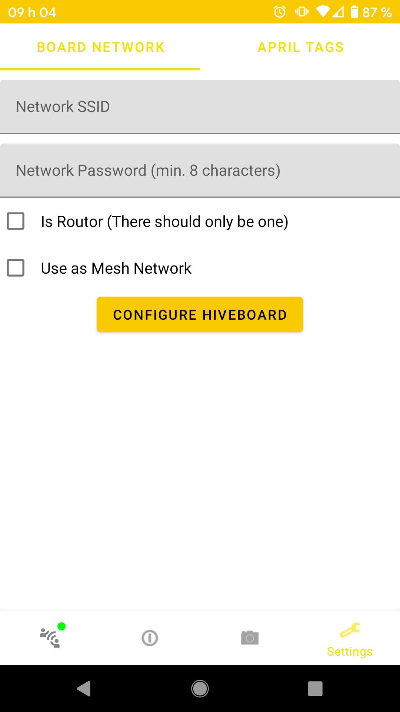

The easiest way to configure the Wi-Fi network on HiveBoards is by using the [HiveAR](../HiveAR/hivear-preface.md) Android application. Each HiveBoard will need to be configured individually, so the following procedure should be repeated for every board that you wish to connect to a same Wi-Fi network.

!!! important
    Before you start, make sure you have the most recent version of the [HiveAR](../HiveAR/hivear-preface.md) app that can be found on the project [GitHub](https://github.com/SwarmUS/HiveAR) page. The installation files are generated by the continuous integration pipeline as artifacts. You can download an APK file by clicking on one of the [workflow runs](https://github.com/SwarmUS/HiveAR/actions) and then selecting the apk file.

Follow [these instructions](../HiveAR/hivear-setup.md) to connect an Android device running HiveAR to a HiveBoard. Then, follow the steps in the next section to set up the Wi-Fi network.

## Set up the Wi-Fi Network 

!!! important 
    **Before you set up the Wi-Fi**

    Make sure that all the HiveBoards have their Wi-Fi antennas plugged in. This might save a few headaches.

Navigate to the Settings view by tapping the wrench icon at the lower right of the screen. This contains a tab which allows for the configuration of the Wi-Fi network:

<figure markdown>
{: style="height:700px;align:left" }
</figure>

Enter the configuration for the Wi-Fi network. There are a few different topologies that you might want to consider. Before you set up the network, refer to the [limitations](#limitations).

### External Router

You can set up a Wi-Fi network using an external wireless router. This way, you'll want to connect all of the HiveBoards to that router. 

Enter the SSID and password of you external Wi-Fi network and tap `Configure HiveBoard`. This will load the configuration to the ESP-32 Wi-Fi module. Make sure the network respects the [limitations](#limitations).

When the HiveBoard has successfully connected to the network, the networking status LED will turn green. Refer to the [HiveBoard UI](../../hardware/HiveBoard/hiveboard-ui.md#led-wroom-rgb-networking-status-led-esp-32) page for a comprehensive list of the RGB LED states.

### Single HiveBoard as a Router

You can choose to use one of the HiveBoards to act as the router for the Wi-Fi network. That way, there is no need to provide an external router, and the swarm is able to work on its own.

On the HiveBoard that you want to use as the router, check the `Is Router` box. Set the SSID and the password for the network. Tap `Configure HiveBoard` to load the configuration. Make sure the network respects the [limitations](#limitations). Once the router configuration has been loaded, the RGB LED for the ESP-32 will turn teal. Refer to the [HiveBoard UI](../../hardware/HiveBoard/hiveboard-ui.md#led-wroom-rgb-networking-status-led-esp-32) page for a comprehensive list of the RGB LED states.

On the other HiveBoards, simply connect to the Wi-Fi network you just created. Make sure to leave the `Is Router` box **unchecked**.

### Mesh Networking

As of now, the mesh networking is not implemented.

### Limitations

There are a few limitations to consider when setting up a new Wi-Fi network to use with your HiveBoards:

* The ESP-32 chips only support 2.4 GHz Wi-Fi networks. 5 GHz band is **not** supported.
* The **maximum** length of the SSID is 32 characters.
* The **minimum** length of the password is 8 characters.
* Only WPA2-PSK is supported.