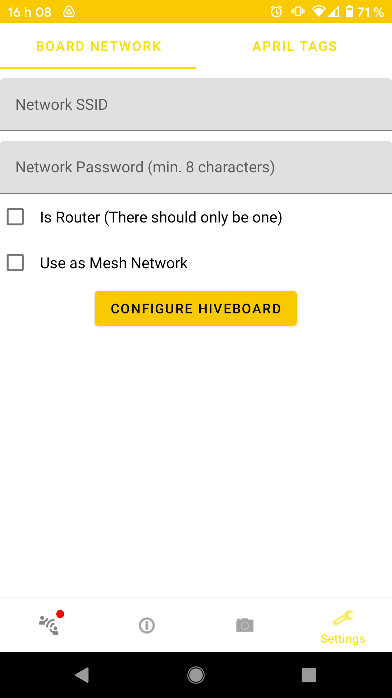

The easiest way to configure the Wi-Fi network on HiveBoards is by using the [HiveAR](https://github.com/SwarmUS/HiveAR) Android application. Each HiveBoard will need to be configured individually, so the following procedure should be repeated for every board that you wish to connect to a same Wi-Fi network.

> Before you start, make sure you have the most recent version of the [HiveAR](https://github.com/SwarmUS/HiveAR) app. The installation files are generated by the continuous integration pipeline as artifacts. You can download an APK file by clicking on one of the [workflow runs](https://github.com/SwarmUS/HiveAR/actions) and then selecting the apk file.

## Connect the Android Device to the HiveBoard

To connect the HiveAR app running on an Android device to a HiveBoard, **you must first disconnect the Ethernet cable from the HiveBoard**. Then, plug the micro-USB cable from the HiveBoard to the Android Device as shown in the image below.

> **Why must the Ethernet cable be disconnected?**

> A HiveBoard can only be connected to one host at a time (be it a robot runnung [HiveMindBridge](https://github.com/SwarmUS/HiveMindBridge), usually connected vie Ethernet, or an Android device running HiveAR). If the HiveBoard and the robot's embedded computer already have a connection established, it will be impossible to establish a second connection to the Android device. Thus, we advise that you unplug the Ethernet cable prior to using HiveAR with a given HiveBoard.

## Establish a connection between HiveAR and HiveMind

Launch the HiveAR application on the Android device. Accept the different permission requests.

Navigate tot the Connection tab (first icon on the left at the base of the screen).

{: style="height:700px" }

Click on the circular button containing two arrows pointing at each other in the lower left side of the screen. A selection bar will appear at the top of the screen:

{: style="height:700px;align:left" }

Tap on the bar and select option `HiveBoard: HiveMind`. Then tap Connect. The logs should show that the greet messages have been exchanged and you should see a green dot appear near the Connection button at the lower left of the screen:

{: style="height:700px;align:left" }

## Set up the Wi-Fi Network

Navigate to the Settings view by tapping the wrench icon at the lower right of the screen. This contains a tab which allows for the configuration of the Wi-Fi network:

{: style="height:700px;align:left" }

Enter the configuration for the Wi-Fi network. There are a few different topologies that you might want to consider. Before you set up the network, refer to the [limitations](#limitations).

### External Router

You can set up a Wi-Fi network using an external wireless router. This way, you'll want to connect all of the HiveBoards to that router. 

Enter the SSID and password of you external Wi-Fi network and tap `Configure HiveBoard`. This will load the configuration to the ESP-32 Wi-Fi module. Make sure the network respects the [limitations](#limitations).

### Single HiveBoard as a Router

You can choose to use one of the HiveBoards to act as the router for the Wi-Fi network. That way, there is no need to provide an external router, and the swarm is able to work on its own.

On the HiveBoard that you want to use as the router, check the `Is Router` box. Set the SSID and the password for the network. Tap `Configure HiveBoard` to load the configuration. Make sure the network respects the [limitations](#limitations).

On the other HiveBoards, simply connect to the Wi-Fi network you just created. Make sure to leave the `Is Router` box **unchecked**.

### Mesh Networking

The mesh networking is not implemented as of now.

### Limitations

There are a few limitations to consider when setting up a new Wi-Fi network to use with your HiveBoards:

* The ESP-32 chips only support 2.4 GHz Wi-Fi networks. 5 GHz band is **not** supported.
* The **maximum** length of the SSID is 32 characters.
* The **minimum** length of the password is 8 characters.
* Only WPA2-PSK is supported.