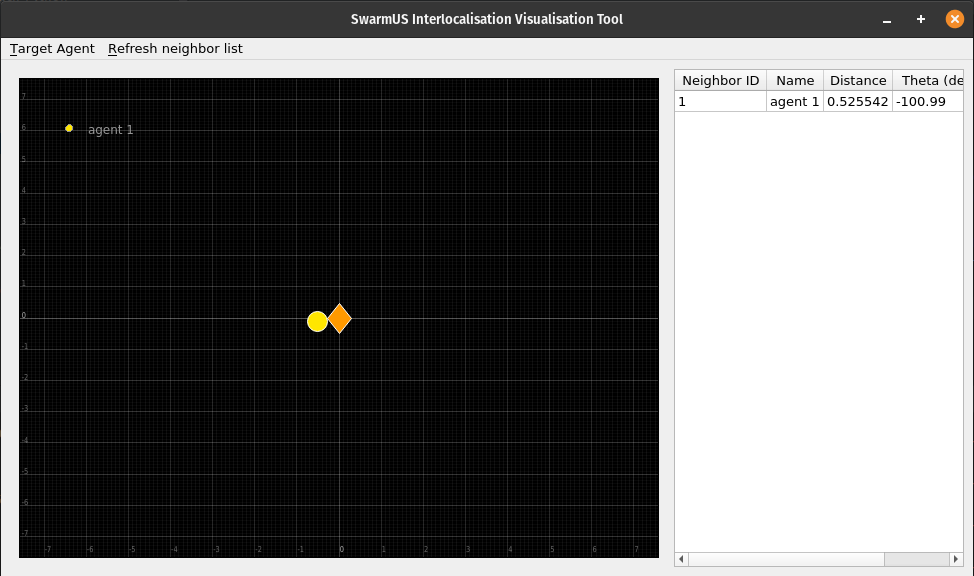
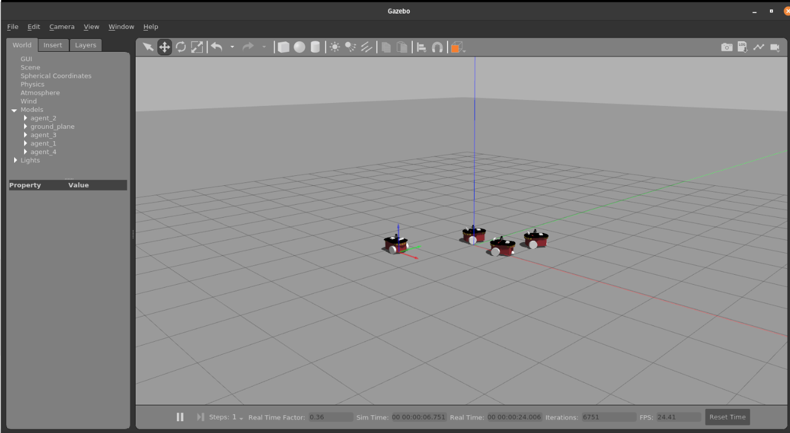

# Using Interlocalisation Between Swarm Agents

One of the key features of the SwarmUS platform is the ability for a given Hiveboard to determine the position of other Hiveboards with respect to its own position. This page shows how to use this *interlocalisation* feature. SwarmUS' interlocalisation feature provides the necessary data to the [neighbor feature of the Buzz language](https://github.com/buzz-lang/Buzz/blob/master/doc/api.md#neighbors). This means that the HiveMind firmware merely updates the position of the other agents and makes it available to Buzz.

!!! Note
    The interlocalisation module is a rather complex feature of the SwarmUS platform. For extensive documentation about the design and implementation of the feature, refer to [the How it Works section](../../reference/Interloc/how_it_works/intro.md).

!!! attention
    Before you start using the interlocalisation feature, refer to the instructions on [how to calibrate](../../reference/Interloc/calibrating_a_hiveboard.md) the BeeBoards with a HiveBoard. Since the interlocalisation feature relies on very sensitive hardware, it is crucial that the HiveBoard/BeeBoard assembly be adequately calibrated, otherwise the readings will be rubbish.

## Using the Visualisation Tool

When the interlocalisation is adequately calibrated, you can test that the HiveBoard/Beeboard assemblies can acquire their respective positions using the [graphical visualisation tool](https://github.com/SwarmUS/TestBench-Python). Refer to the README file for instructions on how to use the tool.



## Accessing Neighbors' Position in a Buzz Script

As said earlier, Buzz has a neighbor management feature, which allows to access the position of the other agents, among other things.

!!! note
    Since neighbor management is a feature of Buzz, it will not be extensively documented here. Refer to the [official documentation](https://the.swarming.buzz/wiki/doku.php?id=buzz_syntax_cheatsheet&s[]=neighbors) and the [language reference](https://github.com/buzz-lang/Buzz/blob/master/doc/api.md).

The SwarmUS platform feeds the interlocalisation data to Buzz, which itself makes it available to the user via the `neighbors` structure. The following snippet shows how the `neighbors` structure might be used. This Buzz script performs a _follow the leader_ example in which the agents will move towards the agent #1.

```python
include "utils/executor.bzz"
include "vec2.bzz"

function tick(context){
    var leader = 1;

    if(leader != id and leader != nil){
        log("Trying to get leader: ", leader)
        var neighbor = neighbors.get(leader);

        if(istable(neighbor)){
            # Set a new goal based on the interlocalisation data found in 
            # the neighbor object
            var goal = math.vec2.newp(neighbor.distance - 0.5, neighbor.azimuth);
            log("Moving to leader: ", leader, " at x:", goal.x, " y:", goal.y);

            # Move the robot toward the goal.
            call_host_function(id, "moveBy", {.0 = goal.x, .1 = goal.y});
        }
        else{
            log("Neighbor not found!");
        }
    }
}

function create_exec(step_count) {
  counter = 0;

  exec = executor.new(step_count, tick, nil);
  return exec;
}
```

This script uses Buzz' `math.vec2` library (documentation [here](https://github.com/buzz-lang/Buzz/blob/master/doc/api.md#mathvec2lib)). This library helps to handle 2D vectors. Neighbor management is performed with the `neighbors` structure. Each member of this structure has the attributes `distance` and `azimuth`. This is how the interlocalisation data is accessed.

Verification of the neighbor is done using the `istable` function, documented [here](https://swarmus.github.io/HiveMind/namespaceBittyBuzzUserFunctions.html#a47f43221b7fd135259c540016ae55544).

!!! hint
    The Buzz documentation has some other examples ([here](https://the.swarming.buzz/wiki/doku.php?id=buzz_examples) and [here](https://github.com/buzz-lang/Buzz/tree/master/doc/examples)) of scripts that make use of the `neighbors` structure. The HiveMind repository also has a number of [examples](https://github.com/SwarmUS/HiveMind/tree/master/src/bittybuzz/buzz_scripts/behaviors).

## Testing in Simulation Using Gazebo

The SwarmUS project relied heavily on the Gazebo simulator for the development. [This repository](https://github.com/SwarmUS/SwarmUS-ROS) contains the `swarmus_ros_simulation` package, which has some ready-made launchfiles that integrate all the software stack of the SwarmUS platform. Launching `simple_swarm.launch` will start 4 robots, each running a HiveMind instance.

To change the Buzz script that will be used by all the robots in the simulation, edit the HiveMind codebase found under `contrib/` folder. For instance, if you want to run a *follow the leader* simulation, add the code shown in the previous section to `contrib/src/bittybuzz/buzz-scripts...`.



## Accessing Neighbors Outside of Buzz

The interlocalisation data can also be accessed outside of Buzz. The [HiveMind API](../../reference/HiveMind/hivemind-api.md) exposes neighbor requests (`GetNeighborsListRequest`, `GetNeighborRequest`) that can be called by any host.

The calls to the HiveMind API for updating neighbors have been convieniently wrapped in the [HiveMindBridge library](https://swarmus.github.io/HiveMindBridge/classIHiveMindBridge.html).