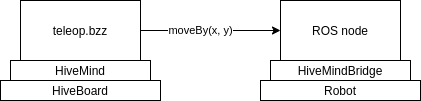
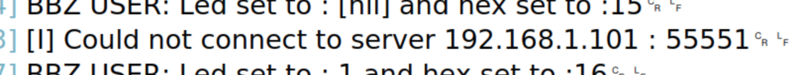
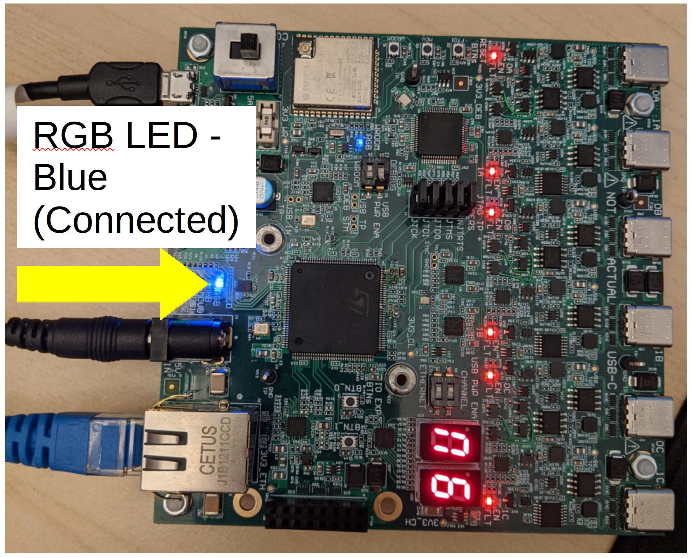

# Controlling a robot using Buzz

Now that the code that runs on your Hiveboard can flash an LED [of its own](led-flash-buzz.md) or one from a [remote board](led-flash-remote-hiveboard.md), let's establish a connection between a Hiveboard and a robot's embedded computer. The goal here is to use a Buzz script to tele-operate a robot.



## Initial Setup

> Before we start, make sure that the HiveBoard has a HiveMind firmware flashed. Follow the instructions from [this previous tutorial](led-flash-buzz.md) to flash a firmware on the device.

The HiveBoard connects to the robot's embedded computer using an Ethernet cable. Communication between the two is established via TCP. Connect the HiveBoard as shown in the image below. The micro-USB cable should be plugged into your computer since we will be flashing some Buzz code on the device. The Ethernet must be plugged into the robot's embedded computer. Power on the HiveBoard by setting the switch to the `CON` position.


### Network configuration

The HiveMind firmware expects the robot's computer to have a precise IP address. In the robot's embedded computer, set a static IP address on the Ethernet network adapter with the following parameters:

* IPv4 address : `192.168.1.101`
* Subnet mask: `255.255.255.0`

> The network configuration can be changed by using CMake variables. See [HiveMind readme](https://github.com/SwarmUS/HiveMind#readme) for more on this. The robot's embedded computer is refered to as the _HOST_.

### Testing the connection

The HiveBoard has a static IP address set to `192.168.1.10`. From the embedded computer (we will call this the _host_ from now on), try to ping the HiveBoard to see if the Ethernet connection works.

> If ping fails, double check the previous steps and make sure that the power switch is indeed to the `CON` position, and not to `USB`.

Next, open the COM port to see the HiveBoard's logs (usually `USBtty2`). You should see that the HiveBoard attempts to connect to a host:



This is expected at this point since there is no HiveMindBridge running on the host computer yet. 

## Creating a Bridge for the robot

Now that there is an Ethernet link between the HiveBoard and the host, we need to write some software that will act as a bridge between HiveMind (the HiveBoard's firmware) and the rest of the robot's software stack. From now on, we will assume that the robot runs ROS1 and has a fully working navigation stack, so we will show the setup accordignly.

The SwarmUS project comprises a C++ library named [HiveMindBridge](https://github.com/SwarmUS/HiveMindBridge) that helps interfacing the HiveBoard with the outside world. Using HiveMindBridge, you can define and expose an API from the robot to the swarm.

Let's create a minimal ROS node that uses HiveMindBridge to show some basic capabilities. The robot will expose two simple functions to the swarm. Both functions are callable by other swarm agents or by the robot's HiveBoard:

* `moveBy(float x, float y)`: this function will forward moving commands to the robot's navigtion stack. `moveBy` is the entrypoint to control the robot's position remotely. The arguments `x` and `y` are displacement values relative to the robot's own position. The function does not return any payload.
* `getStatus()`: this function will return some payload containing some information about the robot's state.

This (minimal) configuration will yield a simple robot that can be remote-controlled and that can inform on its state.

### Prerequisites to using HiveMindBridge

HiveMindBridge is a C++ library that must be installed on a system, and then included to a software project using CMake. Before implementing the ROS node that uses HiveMindBridge, follow [these instructions](https://github.com/SwarmUS/HiveMindBridge#readme) to build and install HiveMindBridge on the host computer. Make sure to use the provided commands from the CMake example within your ROS package's `CMakeLists.txt`. You might want to check [this example](https://github.com/SwarmUS/SwarmUS-ROS/tree/master/src/swarmus_turtlebot) implementation of a Bridge with a TurtleBot 3.

### `HiveMindBridge`: the unique entrypoint to the library

HiveMindBridge is a simple library that supports registering asynchronous callbacks to serve as a bridge between the communication services encapsulated in the swarm services and the local ROS environment. The user will mainly use the `HiveMindBridge` class to register custom actions, send some data over the messaging service and control the execution flow.

Instantiating a `HiveMindBridge` object is done using the class' only constructor : 

```cpp
// HiveMindBridge.h
HiveMindBridge(int tcpPort, ILogger& logger)
```

HiveMindBridge uses a TCP socket server underneath and requires that the user provide a port for the connection. The second input argument is a logger that must be injected. The logger must implement the `ILogger` interface (a basic working implementation is provided [here](../../reference/HiveMindBridge/logger.md)).

### Full example

The following listing shows the basic example, where the two aforementioned functions are registered (`moveBy(x, y)` and `getStatus()`). This example is used within a ROS application context. We left the ROS-specific calls in the example to ease understanding. Note however that HiveMindBridge is completely ROS-agnostic, and could be used in a plain C++ project.

We will break everything down after this listing.

```cpp
#include "hivemind-bridge/Callback.h"
#include "hivemind-bridge/HiveMindBridge.h"
#include "ros/ros.h"
#include "swarmus_ros_navigation/MoveByMessage.h"
#include <cpp-common/ILogger.h>
#include <cstdarg>
#include <optional>
#include <pheromones/FunctionCallArgumentDTO.h>

int main(int argc, char** argv) {
    ros::init(argc, argv, "hive_mind_bridge");
    ros::NodeHandle nodeHandle("~");
    
    // ROS publisher: this will publish the moveBy command to the navigation stack
    std::string moveByTopic =
        nodeHandle.param("moveByTopic", std::string("/agent1/navigation/moveBy"));
    ros::Publisher moveByPublisher =
        nodeHandle.advertise<swarmus_ros_navigation::MoveByMessage>(moveByTopic, 1000);
    
    int port = 55551;
    Logger logger; // See above for more info on loggers. For this example, 
    // let's just assume the class is accessible within the scope of this file.

    // Create a HiveMindBridge object
    HiveMindBridge bridge(port, logger);

    // Register the first custom action: moveBy(x, y). This function will simply forward the x and y values 
    // to the navigation stack using a ROS publisher.
    CallbackFunction moveByCallback = [&](CallbackArgs args,
                                          int argsLength) -> std::optional<CallbackReturn> {
        if (argsLength != 2) {
            ROS_WARN("Received incorrect number of arguments in moveBy");
            return {};
        }

        swarmus_ros_navigation::MoveByMessage moveByMessage;

        auto* x = std::get_if<float>(&args[0].getArgument()); // The arguments are contained 
        // in `args`. The body of the function is where users should define the position of the arguments.
        auto* y = std::get_if<float>(&args[1].getArgument());

        if (x == nullptr || y == nullptr) {
            ROS_WARN("Received invalid argument type in moveBy");
            return {};
        }

        moveByMessage.distance_x = *x;
        moveByMessage.distance_y = *y;

        // Publish on moveby topic
        moveByPublisher.publish(moveByMessage);

        return {}; // This function does not return any payload, so we return an empty struct
    };

    // Register the function's manifest, name and pointer in our `HiveMindBridge` object.
    CallbackArgsManifest moveByManifest;
    moveByManifest.push_back(
        UserCallbackArgumentDescription("x", FunctionDescriptionArgumentTypeDTO::Float));
    moveByManifest.push_back(
        UserCallbackArgumentDescription("y", FunctionDescriptionArgumentTypeDTO::Float));
    bridge.registerCustomAction("moveBy", moveByCallback, moveByManifest);

    
    // Register the second custom action: getStatus()
    CallbackFunction getStatus = [&](CallbackArgs args,
                                     int argsLength) -> std::optional<CallbackReturn> {
        int64_t isRobotOk = 1; // Let's assume there is some complex logic here 
        // to check the status of the robot's components...

        // Build the return payload and return. 
        CallbackArgs returnArgs;
        returnArgs[0] = FunctionCallArgumentDTO(isRobotOk);
        CallbackReturn cbReturn("getStatusReturn", returnArgs);
        return cbReturn;
    };

    // Register the name and pointer for the getStatus() function. 
    // Notice that no manifest is passed, since this function takes no input argument.
    bridge.registerCustomAction("getStatus", getStatus);

    // Register event hooks. HiveMindBridge provides a few event hooks that allow 
    // the user to control the execution flow.
    bridge.onConnect([]() { ROS_INFO("Client connected."); });

    bridge.onDisconnect([]() { ROS_INFO("Client disconnected."); });

    // The main application loop
    ros::Rate loopRate(RATE_HZ);
    while (ros::ok()) {
        ros::spinOnce();

        bridge.spin(); 

        loopRate.sleep();
    }

    return 0;
}
```

#### Creating a `HiveMindBridge` object

```cpp
int port = 55551;
Logger logger; 

HiveMindBridge bridge(port, logger);
```

To create a `HiveMindBridge` instance, the user must provide a logger that implements the `ILogger` interface (see [here](../../reference/HiveMindBridge/logger.md) for a full example). The `port` input argument is needed in order to bind the TCP socket used by HiveMindBridge. 

> HiveMindBridge acts as a TCP _server_ and will wait for clients to initiate a connection.

#### Registering custom actions

The example above shows the registration of two functions, `moveBy(x, y)` and `getStatus()`. Both have their own characteristics which help illustrate the capabilities of HiveMindBridge.

Registering custom actions is always done by following three steps : 

1. Define the callback that describes the behaviour of the custom action (see [Defining Callbacks](../../reference/HiveMindBridge/defining-callbacks.md)).
2. Define the manifest that describes the input arguments of the callback (see [Defining Manifests](../../reference/HiveMindBridge/defining-manifests.md). This is optional, as some callbacks will not require any input arguments)
3. Register the custom action in the `HiveMindBridge` object (see [Registering Custom Actions](../../reference/HiveMindBridge/registering-custom-actions.md)).

**Registering `moveBy(float x, float y)`**

The `moveBy(float x, float y)` function takes two arguments and returns no payload. This function simply forwards the two input arguments to the navigation stack by publishing on a ROS topic.

```cpp
CallbackFunction moveByCallback = [&](CallbackArgs args,
                                        int argsLength) -> std::optional<CallbackReturn> {
    if (argsLength != 2) {
        ROS_WARN("Received incorrect number of arguments in moveBy");
        return {};
    }
    
    swarmus_ros_navigation::MoveByMessage moveByMessage;

    auto* x = std::get_if<float>(&args[0].getArgument());
    auto* y = std::get_if<float>(&args[1].getArgument());

    if (x == nullptr || y == nullptr) {
        ROS_WARN("Received invalid argument type in moveBy");
        return {};
    }

    moveByMessage.distance_x = *x;
    moveByMessage.distance_y = *y;

    moveByPublisher.publish(moveByMessage);

    return {};
};

CallbackArgsManifest moveByManifest;
moveByManifest.push_back(
    UserCallbackArgumentDescription("x", FunctionDescriptionArgumentTypeDTO::Float));
moveByManifest.push_back(
    UserCallbackArgumentDescription("y", FunctionDescriptionArgumentTypeDTO::Float));
bridge.registerCustomAction("moveBy", moveByCallback, moveByManifest);
```

Since the function returns no payload, the user must simply return an empty struct.

> Notice that the order of the arguments match between the manifest and the callback's body. This allows the other swarm element to send the arguments correctly. For more information on this, see [Defining Manifests](../../reference/HiveMindBridge/defining-manifests.md).

**Registering `getStatus()`**

The `getStatus()` function takes no input arguments, but will return some payload. The return payload is wrapped in  a CallbackReturn type that takes the return values in an array. This is because the return payload is wrapped in a function call request that will be placed on the remote caller. See [Defining Callbacks](../../reference/HiveMindBridge/defining-callbacks.md) for more details.

```cpp
    CallbackFunction getStatus = [&](CallbackArgs args,
                                     int argsLength) -> std::optional<CallbackReturn> {
        int64_t isRobotOk = 1; 

        // Build the return payload and return. 
        CallbackArgs returnArgs;
        returnArgs[0] = FunctionCallArgumentDTO(isRobotOk);
        CallbackReturn cbReturn("getStatusReturn", returnArgs);
        return cbReturn;
    };

    bridge.registerCustomAction("getStatus", getStatus);
```

> This example does not have any real logic. In some cases, there could be a need to implement some complex logic, and even some blocking calls to check the state of some robot peripherals. Since all callbacks are run asynchronously, the user can use blocking calls in the body of the callback. See [Defining Callbacks](../../reference/HiveMindBridge/defining-callbacks.md) for more information on this.

#### Registering event hooks

HiveMindBridge provides some events that the user can attach hooks to, in order to control the execution flow. For example, the `onConnect` and `onDisconnect` event can fire user-defined callbacks when the TCP socket's state changes. This can prove useful to halt a robot in the event of a connection error.

```cpp
bridge.onConnect([]() { ROS_INFO("Client connected."); });

bridge.onDisconnect([]() { ROS_INFO("Client disconnected."); });
```

#### Spinning the Bridge

HiveMindBridge has a main thread that must attach to the main application loop. The `HiveMindBridge` object must be spun for it to process the incoming data.

```cpp
// The main application loop
ros::Rate loopRate(RATE_HZ);
while (ros::ok()) {
    ros::spinOnce();

    bridge.spin(); // Spinning the bridge

    loopRate.sleep();
}
```

## Writing a Buzz Script to Control the Robot

Now that we have written a bridge for the host-side, let's write a Buzz script that sends `MoveBy` commands over to the host.

Open the `HiveMind` codebase and navigate to the folder `src/bittybuzz/buzz_scripts`, where the user-defined Buzz scripts are located.

> The basics on how create and flash a Buzz script to a HiveBoard are explained in a [previous User Guide](led-flash-buzz.md).

Create a new file called `teleop.bzz` containing the following commands. In `main.bzz`, make sure to include `teleop.bzz` at the top of the file.

```python
include "utils/executor.bzz"

function tick(){
    log("Calling host function...");
    call_host_function(id, "moveBy", {.0 = 1.0, .1 = 1.0});
}

function create_exec(){
    exec = executor.new(10, tick);
    return exec;
}
```

This script creates an `executor` (see [this previous User Guide](led-flash-buzz.md) for more on `executors`) which will run the `tick` function periodically. This function contains a `call_host_function()` command that will call a function that was exposed by the host's bridge.

You must provide three arguments to this function:

* The `id` of the current HiveBoard. This is accessed via a global object `id`. The Agent ID is specific to each board and is destined to be shared between the HiveBoard and its host.

* The name of the function to be called on the host. **The spelling of this string must be exactly the same as the function registered against the host's bridge**.

* An array of parameters that are to be passed to the function.

Refer to the [API documentation](https://swarmus.github.io/HiveMind/namespaceBittyBuzzUserFunctions.html) for a complete description of all the available functions.

You may now flash the HiveBoard with this code.

## Greeting the HiveBoard

Now that we have a working bridge implementation, let's test that it can talk with HiveMind, the HiveBoard's firmware. First, make sure that everything is connected like in the [image shown earlier](#initial-setup).

On you PC, open the COM port to view the logs from the HiveBoard (Usually `USBtty2`). You should see some messages indicating that the HiveBoard `Could not connect to server 192.168.1.101 : 55551`.

Next, run the ROS node that we just created on the host computer. Watch the logs from the COM port. After a few seconds, you should see that the host greeted the HiveBoard:

```
Greet succeeded in host_monitor
```

The RGB LED at the bottom of the board should turn from purple to blue when the greet succeeds.



This means that the HiveBoard and the host computer now form an **agent** of the swarm. Both share the same _Swarm Agent ID_, a unique identifier that each agent must hold for as long as it is a part of the swarm. The greeting procedure ensures that the host picks up the ID from the HiveBoard.

> The Swarm IDs are determined by the HiveBoards themselves. Each HiveBoard has a UUID saved in its non-volatile memory that is provided to the host upon greeting. The instructions on how to flash an ID to the HiveBoard are written in [HiveMind's Readme](https://github.com/SwarmUS/HiveMind#readme).

## Testing the `moveBy` command

Now that the HiveBoard and the bridge running on the host computer are both communicating together, we'll make sure that the `moveBy` function called from the Buzz script is indeed forwarded to the ROS environment.

Open a terminal on the host computer and run `rostopic echo /agent1/navigation/moveBy`. You should see some messages:

```
---
distance_x: 1.0
distance_y: 1.0
```
