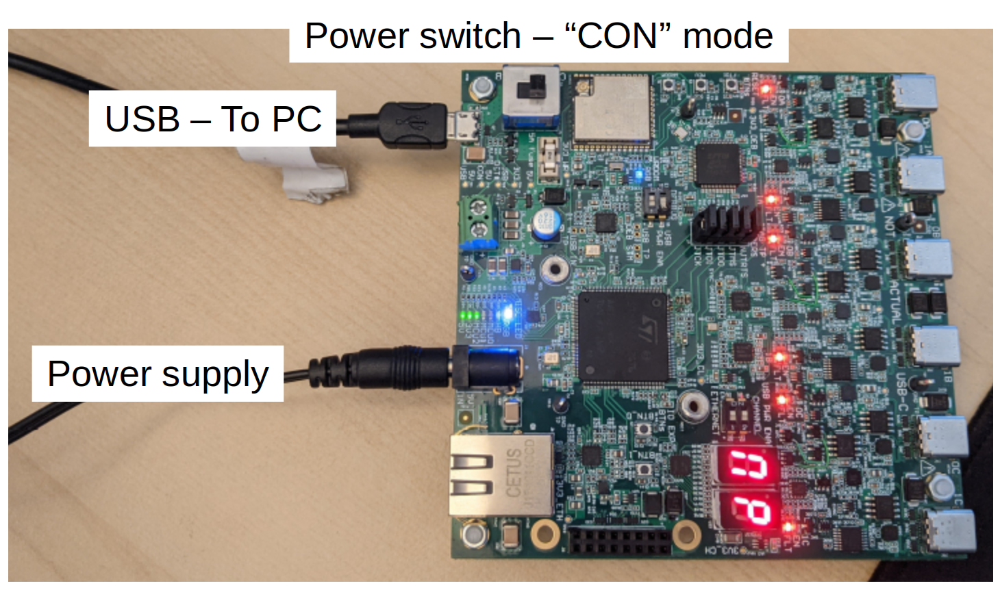
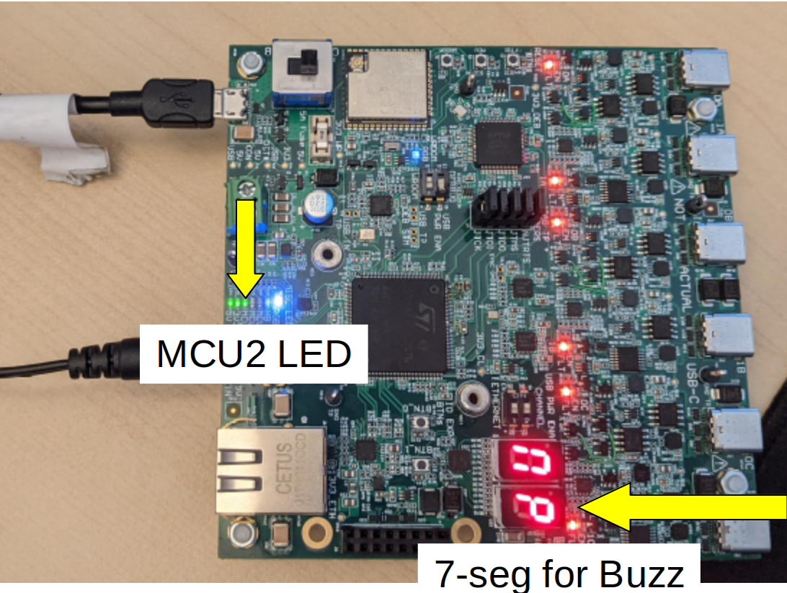
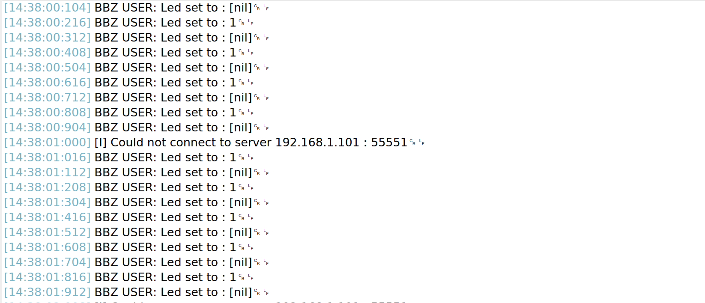

# Flahshing an LED using Buzz

This page presents the steps to write a first basic Buzz script and load it on a HiveBoard. The script will make an LED flash on the board.

!!! Note
    **To follow this user guide, you will need:**

    * A computer running Linux
    * One HiveBoard and its power supply (wall adapter)
    * A micro-USB to USB type A cable

## Set up your environment

Buzz scripts are built and flashed alongside the rest of the [HiveMind](https://github.com/SwarmUS/HiveMind) firmware. You will therefore need to set up your environment to flash the firmware to the board before writing your first Buzz script. Follow the instructions in [HiveMind's README](https://github.com/SwarmUS/HiveMind#readme) file to set up the toolchain.

Start by connecting the HiveBoard to your computer using a micro-USB cable. Next, plug in the power supply using the wall adapter. Turn on the power by setting the power swith to `CON`. You should see the HiveBoard light up. If the HiveBoard already has a firmware, it should output its logs via a COM port (usually `ttyUSB2`). You might want to check the output using your favorite tool.

When you fire up the HiveBoard, you will see some lights flashing. Some of these lights are user-controllable, and some other present the status of the board. Refer to the [UI description](../../hardware/HiveBoard/hiveboard-ui.md) for a complete list of the available lights and buttons.



Next, let's flash the HiveMind firmware to the HiveBoard. Follow the steps written in [HiveMind's README file](https://github.com/SwarmUS/HiveMind/blob/master/README.md) to build and flash your board. **Follow the steps for the H7/HiveBoard**.

!!! important 
    Take a close look to the requirements listed in the README and make sure you use the correct versions of CMake, GCC, arm-gcc, and OpenOCD. 

In HiveMind's README, you will find some steps to build using ROS. You need not follow these steps for now; the ROS build is only used in simulation. This how-to guide only shows how to compile and flash for the HiveBoard.

Once you have successfully flashed the firmware to the board, you may go to the next step, where you will write, compile, and flash a Buzz script.

## Writing a Buzz Script

 User-defined Buzz scripts are located within the [HiveMind](https://github.com/SwarmUS/HiveMind) codebase, in folder [`bittybuzz/buzz_scripts`](https://github.com/SwarmUS/HiveMind/tree/master/src/bittybuzz/buzz_scripts). The Buzz language will not be documented in these guides. Users can refer to the [official documentation](https://github.com/buzz-lang/Buzz/blob/master/doc/api.md).

### The Entrypoint: `main.bzz`

The single entrypoint to the Buzz application is the `main.bzz` file. Here is an example:

```python
# main.bzz
include "blinky.bzz"

function init() {
  exec = create_exec(10);
}

function step() {
    exec.step();
}
```

The main file is used to select the Buzz script to be run, by including the right file. Usually, the main file is not meant to be very long, as all the applicative logic should be in the included file.

In this example, we will create a file called `blinky.bzz`, which will do some basic interaction with the HiveBoard's I/O, namely flashing some LEDs. As you can see in the code snippet above, the `main.bzz` file already includes the name of the file we want to create. 

The main file is written in such way that the user will not need to edit anything but the include tag. It expects the included file to provide a function `create_exec()` as its entrypoint. This function creates an `executor` which will call a function at given intervals (more on that below). Here, we pass the value `10`, which means that the function will be called at every 10 steps of the BittyBuzz virtual machine. For more information on how to configure the step delay, refer to [this page](../../reference/Buzz/index.md).

!!! tip 
    This pattern of using a minimal main is not an absolute rule; users could write everything directly in the `main.bzz` file, instead of using a separate file. This implementation just makes it easier to switch from one buzz script to the other by simply changing the included file in the main.

On your PC, create a `main.bzz` file under `bittybuzz/buzz_scripts` and copy the snippet shown above.

!!! note 
    Il you cloned the HiveMind repository from GitHub, this step might not be required, since the code hosted on GitHub already contains a main file.

### The Script: `blinky.bzz`

The next step is to create a new file called `blinky.bzz` under `bittybuzz/buzz_scripts`. This file should provide a `create_exec()` function to be used within `main.bzz` as an entrypoint. 

The `create_exec()` function must return an `executor` object. An `executor` is simply an object which will call a function at regular intervals (see [`executor.bzz`](https://github.com/SwarmUS/HiveMind/blob/master/src/bittybuzz/buzz_scripts/utils/executor.bzz)).

Let's write the `create_exec()` function:

```python
# blinky.bzz
include "utils/executor.bzz"

ctx = {
    .led = 0,
}

function tick(context){

}

function create_exec(step_count) {
    exec = executor.new(step_count, tick, ctx);
    return exec;
}
```

Creating an `executor` requires three arguments. The first argument is the interval at which the function will be called. In the example above, we use the `step_count` argument, which corresponds to the value `10` passed from `main.bzz`.

!!! hint
    You could also use the `.new_ms` constructor for the executor. In this case, the executor would take an interval in miliseconds, instead of a number of steps (see [here](https://github.com/SwarmUS/HiveMind/blob/master/src/bittybuzz/buzz_scripts/utils/executor.bzz)).

The second argument is the function to be run by the `executor`. Here, we provided the function `tick`, which we also defined above. This function should contain the logic you want to implement.

The third argument is a context table that will be passed to the function `tick` everytime it is run. We use a table instead of plain variables because Buzz always passes tables by reference (and _not_ by value). Therefore, the context can be modified by the `tick` function and it will be persisted between the executions of `tick`.

The `ctx` object contains the value of the LED.

!!! tip 
    **Why should you use an `executor` object instead of sleep functions?**

    The `executor` object serves a similar purpose as a thread with a `while(true)` and a sleep. However, using sleeps will halt some other processing done on the BittyBuzz virtual machine. The `executor` allows for asynchronous, non-blocking delays. See the [Reference](../../reference/Buzz/index.md) section for more details.

#### Writing the `tick()` function

The `tick` function will contain all the applicative logic. In this example, we want to flash an LED. Let's first discuss the function we will use to interact with the HiveBoard's hardware.

HiveMind provides various APIs that the user can use from within the Buzz scripts. One of these APIs are the `BittyBuzzUIFunctions` (see the API reference [here](https://swarmus.github.io/HiveMind/namespaceBittyBuzzUIFunctions.html)). The UI API has functions to control an LED and one of the seven segment display.



In the Buzz script, the user can interact with the UI by using the `ui` global object. To light the LED, simply write: 

```python
ui.set_led(1)
```

To turn the LED off, we write the opposite value:

```python
ui.set_led(nil)
```

!!! hint 
    You could also write `ui.set_let(0)`. The underlying function would then evaluate the value 0 to false. All other integer values would be evaluated to true.

To toggle on and off the LED, we write the following `tick` function:

```python
# blinky.bzz
include "utils/executor.bzz"

ctx = {
    .led = 0
}

function tick(context){
    log("Led set to : ", context.led);
    ui.set_led(context.led);

    # led = !led
    if(context.led){
        context.led = nil;
    } else{
        context.led = 1;
    }
}

function create_exec(step_count) {
    exec = executor.new(step_count, tick, ctx);
    return exec;
}
```

Copy this snippet in `blinky.bzz`. Save the file, and flash the code to the HiveBoard. The HiveBoard will reboot and you should see the MCU2 light blinking.

You'll have noticed in the code that the `tick` function uses a logger. To view the output, use your favorite tool to open the appropriate COM port (usually `ttyUSB2`). You should see the following output:



#### Writing to the seven-segment display

User-defined Buzz scripts also have access to a seven-segment display. This display has been configured to write values from 0 to 15 in hexadecimal format. Let's add some Buzz code to show this.

Writing an hexadecimal value to the seven-segment works the same way as the LED. Using the global object `ui`, we just need to pass the value we want as an argument to the function `set_hex()`:

```python
ui.set_hex(12)
```

Users need only provide the values as integers, and they will be displayed in hexadecimal format. In this case, the value `12` would be displayed as `C`.

Let's add some code to the `blinky` example that will increment the value of the seven-segment up to 15 and then go back to zero:

```python
include "utils/executor.bzz"

ctx = {
    .led = 0,
    .hex = 0
}

function tick(context){
    log("Led set to : ", context.led, " and hex set to :", context.hex);
    ui.set_led(context.led);
    ui.set_hex(context.hex);

    # led = !led
    if(context.led){
        context.led = nil;
    } else{
        context.led = 1;
    }

    if(context.hex > 15){
        context.hex = 0;
    } else {
        context.hex = context.hex + 1;
    }
}

function create_exec(step_count) {
    exec = executor.new(step_count, tick, ctx);
    return exec;
}
```

Flash this code to the HiveBoard. You should see the seven-segment display looping from `0` to `F` and the `MCU2` LED should still blink.
