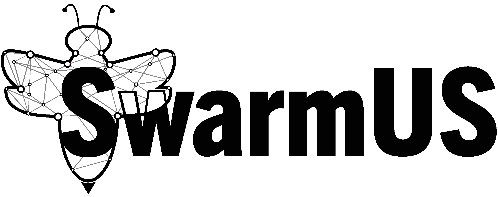
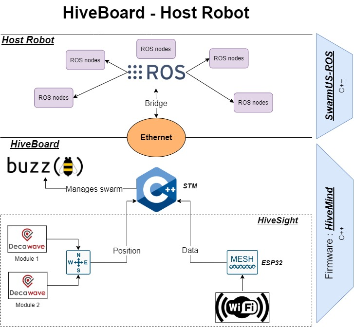

# The SwarmUS Project

 SwarmUS is a project that helps creating swarms using existing robots. It is a generic development platform that empowers researchers and robotics enthousiasts with the ability to deploy some code easily to their robots. SwarmUS provides the basic infrastructure needed for robots to form a swarm : a decentralized communication stack and a localisation module that help robots locate one another without the need for a common reference.

## Architecture

 The HiveBoard is a printed circuit board designed specifically for SwarmUS. It boasts a microcontroller that manages the platform firmware.

 * The HiveBoard provides a **decentralized communication stack** that allows the robots to exchange information and remote procedure calls. The communication stack is managed by the ESP32 module on the HiveBoard.
 * The HiveBoard provides a **localisation module** that allows robots to determine their relative position between one another. Each robot can therefore determine the **distance** and **angle** of another robot with respect to its own position. The localisation module is managed by the two DecaWave modules on the HiveBoard.
 * The firmware that runs on the HiveBoard is called the **HiveMind**. It provides some platform services that allow users to register custom functions.
 * The HiveMind also includes a **Buzz** VM. Buzz is a high-level programming language and runtime specifically designed to govern swarms of robots. More information on the Buzz projets can be found [here](https://github.com/MISTLab/Buzz).

 INSERT LINK TO HIVESIGHT DATASHEET HERE

## ROS Bridge

 The ROS Bridge is a ROS package that provides an interface between the HiveBoard services (Buzz, localisation, communication) and an existing ROS context. It is meant to be easily integrated with a robot that already boasts some embedded code.

 * The ROS Bridge provides a **messaging API** that allows bidirectional communication between the HiveBoard and the ROS context using TCP. The messaging API can be used to send remote procedure calls between the HiveBoard and the ROS Bridge.
 * The ROS Bridge also provides a **callback manager** that allows users to build their own application on top of the platform services. The callback manager is meant to process the remote procedure calls from the messaging API.